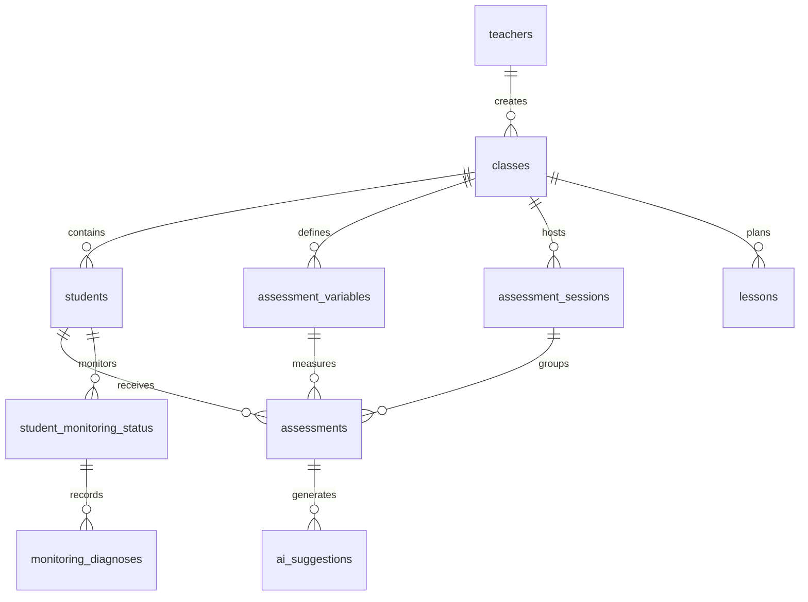

# Data Model & Database Schema

Mehmiro relies on **Supabase (PostgreSQL)** to store assessment, lesson, and monitoring data while enforcing strict privacy guarantees. This page documents core entities, relationships, and operational guidelines.

## Core Entities

### Users (Supabase Auth)

- Authentication & authorization for teachers/administrators.
- No student data stored in auth tables.
- Sessions managed via NextAuth.

### Teachers

| Field      | Type      | Notes        |
| ---------- | --------- | ------------ |
| id         | UUID      | Primary key  |
| name       | text      | Full name    |
| email      | text      | Login email  |
| created_at | timestamp | Auto-managed |
| updated_at | timestamp | Auto-managed |

### Classes

| Field                   | Type      | Notes            |
| ----------------------- | --------- | ---------------- |
| id                      | UUID      | Primary key      |
| teacher_id              | UUID      | FK → teachers.id |
| name                    | text      | Class identifier |
| grade                   | text      | Grade level      |
| section                 | text      | Class section    |
| academic_year           | text      | Year label       |
| created_at / updated_at | timestamp | Auto-managed     |

### Students

| Field                   | Type      | Notes                       |
| ----------------------- | --------- | --------------------------- |
| id                      | UUID      | Primary key                 |
| class_id                | UUID      | FK → classes.id             |
| alias                   | text      | Privacy-friendly identifier |
| avatar_color            | text      | UI personalization          |
| personality_type        | text      | Learning style              |
| date_of_birth           | date      | For age calculations        |
| created_at / updated_at | timestamp | Auto-managed                |

> **Privacy-first:** No personal identifiers are stored; aliases are the only student-facing reference.

### Assessment Variables

- Per-class variable definitions (e.g., “Participation”).
- `scale_min` / `scale_max` define rubric bounds.
- `is_active` toggles availability without loss of history.

### Assessment Sessions

- Temporal grouping (lesson, date, evaluation window).
- `created_by` tracks teacher author.

### Assessments

| Foreign Keys                            | Description              |
| --------------------------------------- | ------------------------ |
| `student_id` → students.id              | Student under evaluation |
| `variable_id` → assessment_variables.id | Metric being scored      |
| `session_id` → assessment_sessions.id   | Session context          |

Additional columns:

- `value` numeric: Recorded score.
- `assessor_type` enum: `'teacher' | 'student' | 'family' | 'ai'`.
- `comments` text: Contextual notes.
- `confidence_score` numeric: AI certainty when applicable.

### AI Suggestions

Captures AI-generated feedback linked to a specific assessment:

- `suggestion_type` enum (`improvement`, `intervention`, `celebration`).
- `content`, `confidence_score`, `is_read`.

### Lessons

Structured lesson planning entity:

- `objectives`, `materials`, `activities` stored as JSON arrays.
- `notes` for qualitative context.
- `created_by` records authoring teacher.

## Student Monitoring (Planned Expansion)

### student_monitoring_status

Tracks traffic-light priority per student/class:

- `priority_flag`: `'red' | 'yellow' | 'green'`.
- Component scores (`observation`, `trend`, `homework`).
- `diagnosis_summary` with latest AI summary.
- `analyzed_at` timestamp.

### monitoring_diagnoses

Historical AI diagnoses:

- `patterns`: JSON describing detected trends.
- `interventions`: JSON array of recommended actions.
- `confidence`, `ai_model`, token usage metadata.

### monitoring_config

Singleton configuration table:

- Scheduling (`analysis_time`, `timezone`, `enabled`).
- Weights (`weight_observation`, `weight_trend`, `weight_homework`).
- Thresholds (`red_threshold`, `yellow_threshold`).
- Row always keyed to `00000000-0000-0000-0000-000000000001`.

## Entity Relationship Diagram



## Design Principles

### Privacy-First

- No personal student data stored.
- Teachers fully control class data.
- Family access (future) remains opt-in and scoped.
- Data minimization enforced across tables.

### Flexible Assessments

- Multiple assessor sources supported.
- Classes create their own variables/scales.
- Sessions enable chronological reporting.
- Comments/confidence extend qualitative context.

### Real-Time Ready

- Supabase subscriptions power live dashboards.
- Optimistic updates with conflict detection for collaborative editing.

### Scalability

- Strategic indexes (see below) keep queries efficient.
- Potential per-class partitioning for large deployments.
- Caching at service layer for hot queries.
- Archive strategy planned for historical data.

## Index & Performance Strategy

```sql
-- Assessment queries
CREATE INDEX idx_assessments_student_date ON assessments(student_id, created_at DESC);
CREATE INDEX idx_assessments_session ON assessments(session_id);
CREATE INDEX idx_assessments_variable ON assessments(variable_id);

-- Sessions
CREATE INDEX idx_sessions_class_date ON assessment_sessions(class_id, date DESC);

-- Variables
CREATE INDEX idx_variables_class_active ON assessment_variables(class_id, is_active);

-- Monitoring
CREATE INDEX idx_monitoring_priority ON student_monitoring_status(class_id, priority_flag, priority_score DESC);
CREATE INDEX idx_monitoring_analyzed ON student_monitoring_status(analyzed_at);
```

All primary keys and foreign keys automatically carry supporting indexes.

## Row Level Security (RLS)

Example policy:

```sql
ALTER TABLE students ENABLE ROW LEVEL SECURITY;

CREATE POLICY "Teachers access their own class students"
ON students
FOR ALL
USING (
  class_id IN (
    SELECT id FROM classes WHERE teacher_id = auth.uid()
  )
);
```

- Teachers limited to their classes.
- Assessments/variables/sessions inherit class-based isolation.
- Foreign key constraints guarantee referential integrity.

## Migration Strategy

1. **Version Control**: All schema changes live under `supabase/migrations/**`.
2. **Local Testing**: Run via Supabase CLI before PR submission.
3. **Staging**: Apply migrations in staging with validation scripts.
4. **Production**: Automate migration execution with rollback plan.

### Data Migration Guidelines

- Prefer backward-compatible adjustments.
- Use transformation scripts for complex changes.
- Validate post-migration data health before releasing.

## Monitoring & Maintenance

- **Health Metrics**: Query performance, index usage, table growth.
- **Backups**: Automated daily backups with point-in-time recovery; stored cross-region.
- **Retention**: Assessments retained indefinitely; AI suggestions archived after two years; audit logs persisted per compliance requirements.

---

**Related References**

- [System Architecture](system-architecture.md)
- [Performance & Security](performance-security.md)
- [Feature Lifecycle](../processes/feature-lifecycle.md)
- Supabase schema (`supabase/schema.sql`) — source of truth for migrations and generated types
