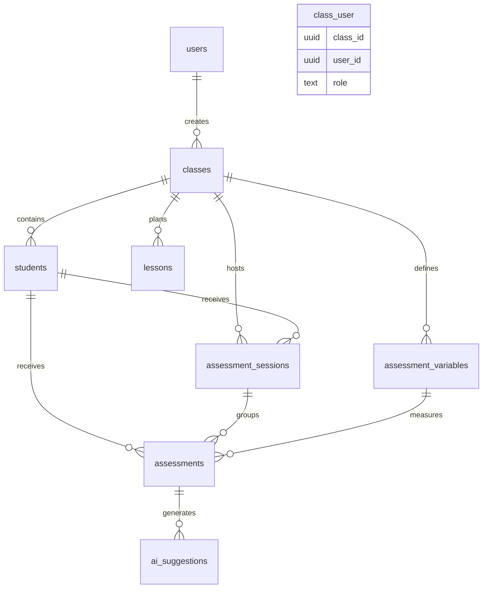

# Data Model & Database Schema

Mehmiro relies on **Supabase (PostgreSQL)** to store assessment, lesson, and class data while enforcing strict privacy guarantees. This page documents core entities based on the actual implementation, relationships, and operational guidelines.

## Core Entities

### Users (Supabase Auth)

- Authentication & authorization for teachers/administrators.
- No student data stored in auth tables.
- Sessions managed via NextAuth with Supabase adapter.

### Users (Application Layer)

| Field      | Type      | Notes        |
| ---------- | --------- | ------------ |
| id         | UUID      | Primary key  |
| name       | text      | Full name    |
| email      | text      | Login email  |
| created_at | timestamp | Auto-managed |
| updated_at | timestamp | Auto-managed |

### Classes

| Field                   | Type      | Notes            |
| ----------------------- | --------- | ---------------- |
| id                      | UUID      | Primary key      |
| name                    | text      | Class identifier |
| grade                   | number    | Grade level      |
| section                 | text      | Class section    |
| year                    | number    | Academic year    |
| school                  | text/null | School name      |
| created_at / updated_at | timestamp | Auto-managed     |

### Students

| Field                   | Type         | Notes                       |
| ----------------------- | ------------ | --------------------------- |
| id                      | UUID         | Primary key                 |
| class_id                | UUID         | FK → classes.id             |
| name                    | text         | Student name                |
| avatar_color            | text         | UI personalization          |
| personality_type        | text/null    | Personality classification  |
| dob                     | date/null    | Date of birth               |
| created_at / updated_at | timestamp    | Auto-managed                |

### Assessment Sessions

| Field               | Type        | Notes                                |
| ------------------- | ----------- | ------------------------------------ |
| id                  | UUID        | Primary key                          |
| student_id          | UUID        | FK → students.id                     |
| assessor_id         | text        | Assessor identifier                  |
| class_id            | UUID        | FK → classes.id                      |
| session_date        | date        | Date of assessment session           |
| assessment_source   | enum        | 'teacher'/'student'/'family'/'ai'    |
| assessor_observation| text/null   | Teacher notes                        |
| ai_prompt           | text/null   | AI analysis prompt                   |
| ai_model            | text/null   | AI model used                        |
| ai_temperature      | number/null | AI temperature setting               |
| ai_tokens_used      | number/null | Token consumption                    |
| ai_response_time    | number/null | AI response time                     |
| ai_analysis_context | text/null   | AI context analysis                  |
| ai_confidence       | number/null | AI confidence score                  |
| ai_limitations      | text/null   | AI limitations notice                |
| created_at / updated_at | timestamp | Auto-managed                     |

### Assessments

| Field              | Type        | Description                       |
| ------------------ | ----------- | --------------------------------- |
| id                 | UUID        | Primary key                       |
| session_id         | UUID/null   | FK → assessment_sessions.id       |
| student_id         | UUID        | FK → students.id                  |
| assessor_id        | text        | Assessor identifier               |
| class_id           | UUID        | FK → classes.id                   |
| variable_id        | UUID        | FK → assessment_variables.id      |
| value              | number      | Assessment score                  |
| comments           | text/null   | Additional notes                  |
| assessment_source  | enum        | 'teacher'/'student'/'family'/'ai' |
| ai_suggestion_id   | UUID/null   | FK → ai_suggestions.id            |
| created_at / updated_at | timestamp | Auto-managed                 |

### Assessment Variables

| Field                   | Type      | Notes                                |
| ----------------------- | --------- | ------------------------------------ |
| id                      | UUID      | Primary key                          |
| class_id                | UUID      | FK → classes.id                      |
| name                    | text      | Variable name                        |
| description             | text      | Variable description                 |
| scale_min               | number    | Minimum scale value (typically 1)    |
| scale_max               | number    | Maximum scale value (typically 6)    |
| is_active               | boolean   | Variable availability status         |
| created_at / updated_at | timestamp | Auto-managed                         |

### AI Suggestions

| Field              | Type      | Notes                                  |
| ------------------ | --------- | -------------------------------------- |
| id                 | UUID      | Primary key                            |
| prompt             | text      | AI analysis prompt                     |
| context_analysis   | text      | AI contextual analysis                 |
| confidence         | number    | AI confidence score (0-1)              |
| limitations        | text      | AI limitations and constraints         |
| created_at         | timestamp | Creation timestamp                     |

### Lessons

| Field                   | Type         | Notes                    |
| ----------------------- | ------------ | ------------------------ |
| id                      | UUID         | Primary key              |
| class_id                | UUID/null    | FK → classes.id          |
| date                    | date         | Lesson date              |
| title                   | text         | Lesson title             |
| objectives              | json         | Lesson objectives array  |
| materials               | json         | Materials array          |
| activities              | json         | Activities array         |
| notes                   | text/null    | Additional notes         |
| created_at / updated_at | timestamp    | Auto-managed             |

## Entity Relationship Diagram



## Design Principles

### Privacy-First

- Student data protected with minimal personal identifiers.
- Teachers fully control class data via Row Level Security.
- Family access remains opt-in and scoped.
- Data minimization enforced across tables.

### Multi-Source Assessments

- Support for teacher, student, family, and AI assessment sources.
- Each assessment tracks its source for comparative analysis.
- AI assessments include confidence scores and limitation notices.
- Session-based grouping enables temporal analysis.

### Real-Time Ready

- Supabase subscriptions power live dashboards and chart updates.
- Optimistic updates with conflict detection for collaborative editing.
- Real-time synchronization across client components.

### Scalability

- Strategic indexes on frequently queried columns.
- UUID primary keys for distributed system compatibility.
- JSON fields for flexible lesson content and AI metadata.
- Caching at service layer for hot queries.

## Index & Performance Strategy

```sql
-- Student queries
CREATE INDEX idx_students_class_id ON students(class_id);

-- Assessment queries
CREATE INDEX idx_assessments_student_id ON assessments(student_id);
CREATE INDEX idx_assessments_session_id ON assessments(session_id);
CREATE INDEX idx_assessments_variable_id ON assessments(variable_id);
CREATE INDEX idx_assessments_source ON assessments(assessment_source);

-- Session queries
CREATE INDEX idx_sessions_student_id ON assessment_sessions(student_id);
CREATE INDEX idx_sessions_class_id ON assessment_sessions(class_id);
CREATE INDEX idx_sessions_date ON assessment_sessions(session_date);

-- Variable queries
CREATE INDEX idx_variables_class_id ON assessment_variables(class_id);
CREATE INDEX idx_variables_active ON assessment_variables(is_active);

-- AI suggestions
CREATE INDEX idx_ai_suggestions_confidence ON ai_suggestions(confidence);
```

All primary keys and foreign keys automatically carry supporting indexes.

## Row Level Security (RLS)

Example policy for student data:

```sql
ALTER TABLE students ENABLE ROW LEVEL SECURITY;

CREATE POLICY "Teachers access their own class students"
ON students
FOR ALL
USING (
  class_id IN (
    SELECT id FROM classes WHERE id IN (
      SELECT class_id FROM class_users 
      WHERE user_id = auth.uid()
    )
  )
);
```

- Teachers limited to their classes via class_users association.
- Assessments/variables/sessions inherit class-based isolation.
- Foreign key constraints guarantee referential integrity.

## Migration Strategy

1. **Version Control**: All schema changes live under `supabase/migrations/**`.
2. **Local Testing**: Run via Supabase CLI before PR submission.
3. **Staging**: Apply migrations in staging with validation scripts.
4. **Production**: Automate migration execution with rollback plan.

### Data Migration Guidelines

- Prefer backward-compatible adjustments.
- Use transformation scripts for complex changes.
- Validate post-migration data health before releasing.
- Monitor AI token usage and API costs during transitions.

## Monitoring & Maintenance

- **Health Metrics**: Query performance, index usage, table growth, AI API costs.
- **Backups**: Automated daily backups with point-in-time recovery; stored cross-region.
- **Retention**: Assessments retained indefinitely; AI metadata archived after two years; audit logs persisted per compliance requirements.
- **AI Monitoring**: Track token usage, response times, and confidence scores for cost optimization.

---

**Related References**

- [System Architecture](system-architecture.md)
- [Performance & Security](performance-security.md)
- [Feature Lifecycle](../processes/feature-lifecycle.md)
- Supabase schema (`supabase/migrations/`) — source of truth for migrations and generated types
