# 🏗️ Architecture Overview

```mermaid
graph TB
    subgraph "🖥️ UI Layer - New Components"
        StudentInsightsView[📊 StudentInsightsView<br/>Main Container]
        OverviewSection[📈 OverviewSection<br/>NEW - Assessment Summary]
        TrendSection[📈 TrendSection<br/>NEW - Progress Analysis]
        AIInsightsSection[🤖 AIInsightsSection<br/>NEW - AI Recommendations]
        ComparisonSection[⚖️ ComparisonSection<br/>NEW - Peer Comparison]
        ExportSection[📤 ExportSection<br/>NEW - Data Export]
    end

    subgraph "🖥️ UI Layer - Reused Components"
        StudentInfo[👤 StudentInfo<br/>EXISTING - Basic Info]
        StudentRadarChart[🕸️ StudentRadarChart<br/>EXISTING - Assessment Viz]
        StudentLinearChart[📈 StudentLinearChart<br/>EXISTING - Trend Viz]
        ViewSelector[🔄 ViewSelector<br/>EXISTING - View Toggle]
        DateNavigation[📅 DateNavigation<br/>EXISTING - Date Picker]
        ErrorBoundary[🛡️ ErrorBoundary<br/>EXISTING - Error Handling]
    end

    subgraph "🪝 Hooks Layer - New Hooks"
        useAssessmentInsights[🪝 useAssessmentInsights<br/>NEW - Insights Logic]
        useTrendAnalysis[🪝 useTrendAnalysis<br/>NEW - Trend Calculations]
        useComparativeAnalysis[🪝 useComparativeAnalysis<br/>NEW - Comparison Logic]
        useExportData[🪝 useExportData<br/>NEW - Export Functions]
    end

    subgraph "🪝 Hooks Layer - Reused Hooks"
        useStudents[🪝 useStudents<br/>EXISTING - Student Data]
        useAssessments[🪝 useAssessments<br/>EXISTING - Assessment Data]
        useAI[🪝 useAI<br/>EXISTING - AI Analysis]
    end

    subgraph "⚙️ Service Layer - New Services"
        AssessmentInsightsService[🎯 AssessmentInsightsService<br/>NEW - Insights Business Logic]
        TrendAnalysisService[📈 TrendAnalysisService<br/>NEW - Trend Calculations]
        ComparativeAnalysisService[⚖️ ComparativeAnalysisService<br/>NEW - Comparison Logic]
        ExportService[📤 ExportService<br/>NEW - Data Export]
    end

    subgraph "⚙️ Service Layer - Reused Services"
        StudentService[👥 StudentService<br/>EXISTING - CRUD Operations]
        AssessmentService[📊 AssessmentService<br/>EXISTING - Assessment Logic]
        AssessmentAI[🤖 AssessmentAI<br/>EXISTING - AI Analysis]
    end

    subgraph "💾 Data Layer"
        SupabaseDB[(☁️ Supabase<br/>Assessments + Sessions)]
        CachedData[(💾 Cache<br/>Computed Insights)]
        ExportStorage[(📁 Export Files<br/>PDF/Excel/CSV)]
    end

    subgraph "🌐 External Integrations"
        ChartLibrary[📊 Chart.js/D3<br/>Visualization]
        PDFGenerator[📄 jsPDF<br/>PDF Export]
        ExcelGenerator[📊 ExcelJS<br/>Excel Export]
    end

    StudentInsightsView --> useAssessmentInsights
    StudentInsightsView --> useStudents
    StudentInsightsView --> useAssessments

    OverviewSection --> useAssessmentInsights
    TrendSection --> useTrendAnalysis
    AIInsightsSection --> useAI
    ComparisonSection --> useComparativeAnalysis
    ExportSection --> useExportData

    StudentInsightsView --> StudentInfo
    TrendSection --> StudentLinearChart
    TrendSection --> DateNavigation
    OverviewSection --> ViewSelector
    ErrorBoundary -.-> StudentInsightsView

    useAssessmentInsights --> AssessmentInsightsService
    useAssessmentInsights --> StudentService
    useAssessmentInsights --> AssessmentService

    useTrendAnalysis --> TrendAnalysisService
    useTrendAnalysis --> AssessmentService

    useComparativeAnalysis --> ComparativeAnalysisService
    useComparativeAnalysis --> StudentService

    useExportData --> ExportService

    useStudents --> StudentService
    useAssessments --> AssessmentService
    useAI --> AssessmentAI

    AssessmentInsightsService --> SupabaseDB
    TrendAnalysisService --> SupabaseDB
    ComparativeAnalysisService --> SupabaseDB
    ExportService --> SupabaseDB

    StudentService --> SupabaseDB
    AssessmentService --> SupabaseDB
    AssessmentAI --> SupabaseDB

    AssessmentService --> AssessmentInsightsService
    StudentService --> AssessmentInsightsService
    StudentService --> TrendAnalysisService
    StudentService --> ComparativeAnalysisService
    AssessmentAI --> AssessmentInsightsService

    AssessmentInsightsService --> CachedData
    TrendAnalysisService --> CachedData
    CachedData -.-> AssessmentInsightsService

    ExportService --> ExportStorage

    TrendSection --> ChartLibrary
    ComparisonSection --> ChartLibrary
    ExportSection --> PDFGenerator
    ExportSection --> ExcelGenerator

    classDef newComponent fill:#e1f5fe,stroke:#01579b,stroke-width:2px
    classDef reusedComponent fill:#f3e5f5,stroke:#4a148c,stroke-width:1px
    classDef newService fill:#e8f5e8,stroke:#1b5e20,stroke-width:2px
    classDef reusedService fill:#fce4ec,stroke:#bf360c,stroke-width:1px

    class OverviewSection,TrendSection,AIInsightsSection,ComparisonSection,ExportSection newComponent
    class StudentInfo,StudentRadarChart,StudentLinearChart,ViewSelector,DateNavigation,ErrorBoundary reusedComponent
    class AssessmentInsightsService,TrendAnalysisService,ComparativeAnalysisService,ExportService newService
    class StudentService,AssessmentService,AssessmentAI reusedService
```

## 🔄 Interaction Flow

## 📊 Data Flow Breakdown

```mermaid
graph LR
    AssessmentData[📊 Assessments<br/>Teacher/Student/Family/AI]
    StudentData[👤 Student Profiles]
    ClassData[🏫 Class Configuration]
    HistoricalData[📈 Historical Sessions]

    Aggregator[🧮 Data Aggregator]
    Normalizer[🧊 Normalization]
    Trends[📈 Trend Calculator]
    Comparisons[⚖️ Comparison Engine]
    Insights[🤖 Insight Generator]
    Exports[📤 Export Formatter]

    AssessmentData --> Aggregator
    StudentData --> Aggregator
    ClassData --> Comparisons
    HistoricalData --> Trends

    Aggregator --> Normalizer
    Normalizer --> Trends
    Normalizer --> Insights
    Trends --> Comparisons

    Trends --> Visualization
    Comparisons --> Visualization
    Insights --> Visualization
    Visualization --> Exports

    subgraph Storage
        Cache[(💾 Cache)]
        Files[(📁 Export Storage)]
    end

    Trends --> Cache
    Comparisons --> Cache
    Cache -.-> Insights

    Exports --> Files
```

## 🎯 Architectural Decisions

- **Reuse over rebuild**: Extend existing chart components, hooks, and services.
- **Composable hooks**: Feature hooks wrap shared data sources with domain-specific logic.
- **Service orchestration**: Insights service aggregates multiple domains and AI interactions.
- **Caching**: Heavy computations cached with invalidation tied to assessment updates.
- **Export pipeline**: Centralized service supports multi-format output and logging.

## 📈 Implementation Phases (Reference)

| Phase                  | Focus                               | Outcome             |
| ---------------------- | ----------------------------------- | ------------------- |
| 1. Foundation          | Services, types, schema updates     | Internal APIs ready |
| 2. Core UI             | Overview + trend UI                 | Teacher-facing MVP  |
| 3. AI Integration      | Insight generation, fallback UX     | AI augmentations    |
| 4. Comparison + Export | Benchmarking + reports              | Stakeholder-ready   |
| 5. Polish              | Testing, performance, documentation | Production launch   |

Refer back to [Overview](overview.md) for functional context and testing strategy.
