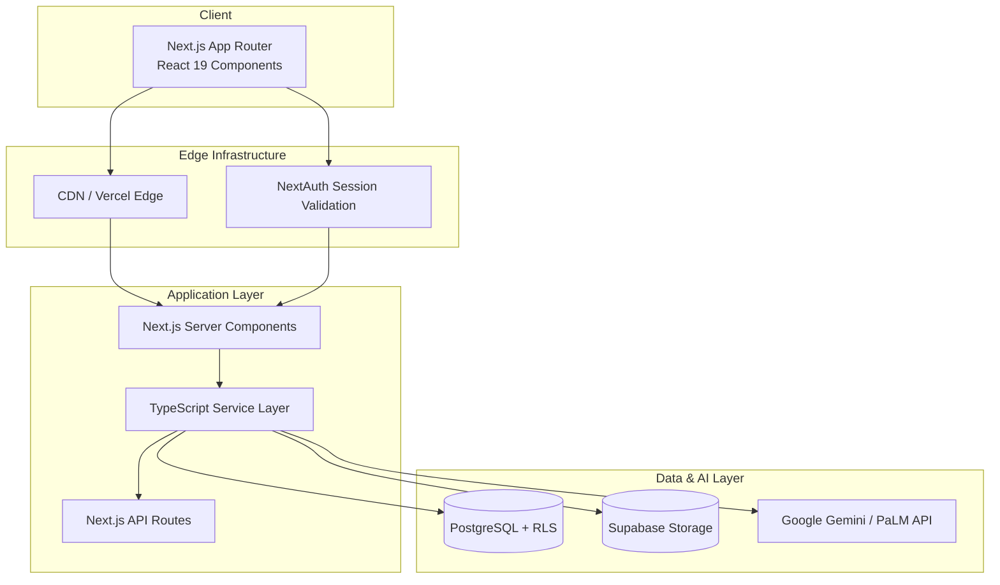

# Arquitectura del Sistema

## Resumen de Alto Nivel



La plataforma usa **Next.js 15 (App Router)** con React Server Components para experiencias renderizadas en servidor y Client Components para paneles interactivos. La lógica de negocio reside en una capa de servicios bajo `app/lib/services`, con Supabase proporcionando base de datos, autenticación y capacidades en tiempo real. Las características de IA se integran a través de APIs de Google Gemini.

## Estructura de Directorio de la Aplicación

```text
app/
├── layout.tsx                  # Root layout, metadata, providers
├── page.tsx                    # Default landing
├── globals.css                 # Tailwind base layers
├── (routes)/
│   ├── dashboard/
│   ├── class/[id]/
│   ├── student/[id]/
│   ├── onboarding/
│   └── ...
├── api/                        # RESTful API routes
├── components/                 # Shared UI
├── hooks/                      # Client-side data orchestration
└── lib/
    ├── services/               # Domain services
    ├── supabase.ts             # Supabase client init
    ├── schemas.ts              # Zod validation
    ├── database.types.ts       # Generated types
    └── ...
```

### Enrutamiento

- **Grupos de rutas** organizan layouts sin impactar URLs (`(routes)`).
- **Rutas dinámicas** (ej. `/class/[id]`, `/student/[id]`) obtienen datos del lado del servidor, luego hidratan Client Components.
- **Rutas API** bajo `app/api/*` proporcionan acceso seguro a datos y endpoints de integración.

## Servicios Principales

| Servicio                      | Responsabilidad                                                                   |
| ----------------------------- | --------------------------------------------------------------------------------- |
| `student-service.ts`          | Obtiene perfiles estudiantiles, agrega historial de evaluaciones, aplica políticas RLS. |
| `assessment-service.ts`       | CRUD para sesiones de evaluación, variables y resultados.                         |
| `lesson-service.ts`           | Gestiona creación de lecciones, personalización y programación.                   |
| `assessment-ai.ts`            | Encapsula generación de prompts IA y análisis de respuestas para perspectivas.    |
| `assessment-insights-service.ts` | Calcula tendencias, comparaciones y resúmenes impulsados por IA.                 |
| `class-service.ts`            | Maneja configuración a nivel de clase, variables y gestión de listas de estudiantes.|
| `onboarding-service.ts`       | Orquesta flujos de trabajo de incorporación de profesores y persistencia.         |

Los servicios exponen métodos tipados consumidos por rutas API y hooks. Centralizan efectos secundarios (llamadas Supabase, solicitudes IA, caché).

## Flujo de Datos

1. **Interacción del Usuario**: El profesor carga una página o activa una acción.
2. **Obtención de Componente Servidor**: La obtención de datos del lado del servidor ocurre en loaders de layout/página para SEO y acceso seguro.
3. **Capa de Servicios**: La lógica de negocio se ejecuta, combinando consultas Supabase, llamadas IA y reglas de dominio.
4. **Base de Datos**: Supabase impone Seguridad a Nivel de Fila, devolviendo datos con alcance.
5. **Hidratación del Cliente**: React hidrata componentes del cliente, conectándose a hooks personalizados para actualizaciones y mutaciones.
6. **Actualizaciones en Tiempo Real**: Las suscripciones Supabase notifican a hooks/servicios, actualizando gráficos y paneles en vivo.

## Puntos de Integración

- **Supabase Auth**: Maneja tokens de sesión consumidos por NextAuth.
- **Supabase Postgres**: Almacén de datos principal con migraciones bajo `supabase/migrations`.
- **Supabase Storage**: Almacena archivos, adjuntos de lecciones (futuro).
- **Proveedores IA**: Google Gemini para generación de perspectivas (por especificación de característica).
- **Cron Externo (planificado)**: Para tareas programadas (monitoreo estudiantil, actualización de análisis).

## Requisitos No Funcionales

### Seguridad

- HTTPS aplicado, cookies seguras, protección CSRF vía NextAuth.
- Las políticas RLS restringen acceso a datos para profesores/admins propietarios.
- Los endpoints API validan entrada a través de esquemas Zod antes de persistencia.

### Rendimiento

- Los Componentes del Servidor minimizan cargas útiles del cliente.
- La capa de servicios caché frecuentes datos y reutiliza conexiones Supabase.
- Los gráficos cargan perezosamente; los componentes esqueleto mantienen rendimiento percibido.
- Turbopack ayuda a builds de desarrollo rápidos; la regeneración estática incremental de Next.js (ISR) disponible para páginas de marketing futuras.

### Observabilidad (Mejoras Planificadas)

- Logging estructurado vía `app/lib/logger.ts`.
- Integración con logs de Supabase y análisis de Vercel.
- Monitoreo de costo IA, latencia de respuesta y tasas de error.

## Pipeline de Despliegue

1. **Verificaciones de Pull Request**
   - `pnpm run lint -- --fix`
   - `pnpm run test -- --silent`
   - `pnpm run build`
   - `pnpm docs:test` (validación de documentación)
2. **Despliegues de Previsualización** (Vercel)
3. **Migraciones Supabase**
   - Aplicadas vía CLI o paso CI antes del despliegue de producción.
4. **Despliegue de Producción**
   - Automático después de fusión de rama principal con todas las verificaciones en verde.

## Documentación Relacionada

- [Modelo de Datos](data-model.md)
- [Rendimiento y Seguridad](performance-security.md)
- [Ciclo de Vida de Características](../processes/feature-lifecycle.md)
- [Perspectivas de Evaluación Estudiantil](../features/student-assessment-insights/overview.md)
- [Sistema de Monitoreo Estudiantil](/docs/developer/features/student-monitoring-system/overview)
