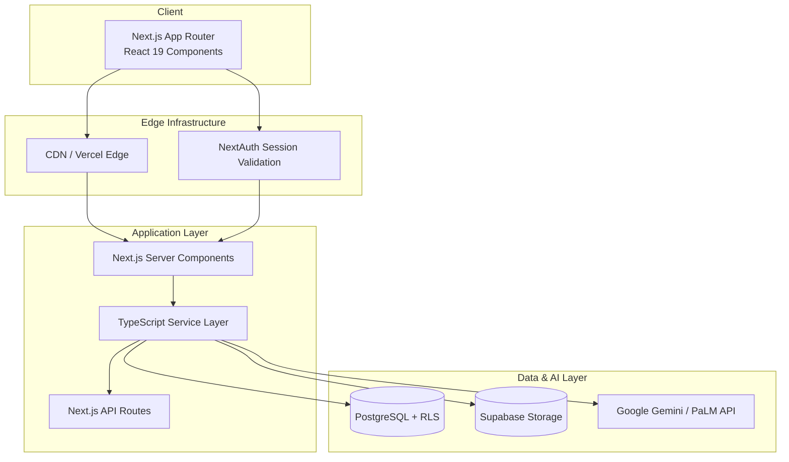

# System Architecture

## High-Level Overview



The platform uses **Next.js 15 (App Router)** with React Server Components for server-rendered experiences and Client Components for interactive dashboards. Business logic resides in a service layer under `app/lib/services`, with Supabase providing database, authentication, and real-time capabilities. AI features integrate through Google Gemini APIs.

## Application Directory Structure

```text
app/
├── layout.tsx                  # Root layout, metadata, providers
├── page.tsx                    # Default landing
├── globals.css                 # Tailwind base layers
├── (routes)/
│   ├── dashboard/
│   ├── class/[id]/
│   ├── student/[id]/
│   ├── onboarding/
│   └── ...
├── api/                        # RESTful API routes
├── components/                 # Shared UI
├── hooks/                      # Client-side data orchestration
└── lib/
    ├── services/               # Domain services
    ├── supabase.ts             # Supabase client init
    ├── schemas.ts              # Zod validation
    ├── database.types.ts       # Generated types
    └── ...
```

### Routing

- **Route groups** organize layouts without impacting URLs (`(routes)`).
- **Dynamic routes** (e.g., `/class/[id]`, `/student/[id]`) fetch data server-side, then hydrate Client Components.
- **API routes** under `app/api/*` provide secure data access and integration endpoints.

## Core Services

| Service                          | Responsibility                                                                  |
| -------------------------------- | ------------------------------------------------------------------------------- |
| `student-service.ts`             | Fetches student profiles, aggregates assessment history, enforces RLS policies. |
| `assessment-service.ts`          | CRUD for assessment sessions, variables, and results.                           |
| `lesson-service.ts`              | Manages lesson creation, personalization, and scheduling.                       |
| `assessment-ai.ts`               | Wraps AI prompt generation and response parsing for insights.                   |
| `assessment-insights-service.ts` | Calculates trends, comparisons, and AI-powered summaries.                       |
| `class-service.ts`               | Handles class-level configuration, variables, and roster management.            |
| `onboarding-service.ts`          | Orchestrates teacher onboarding workflows and persistence.                      |

Services expose typed methods consumed by API routes and hooks. They centralize Side effects (Supabase calls, AI requests, caching).

## Data Flow

1. **User Interaction**: Teacher loads a page or triggers an action.
2. **Server Component Fetching**: Server-side data fetching occurs in layout/page loaders for SEO and secure access.
3. **Service Layer**: Business logic executes, combining Supabase queries, AI calls, and domain rules.
4. **Database**: Supabase imposes Row Level Security, returning scoped data.
5. **Client Hydration**: React hydrates client components, hooking into custom hooks for updates and mutations.
6. **Realtime Updates**: Supabase subscriptions notify hooks/services, updating charts and dashboards live.

## Integration Points

- **Supabase Auth**: Handles session tokens consumed by NextAuth.
- **Supabase Postgres**: Primary data store with migrations under `supabase/migrations`.
- **Supabase Storage**: Stores files, lesson attachments (future).
- **AI Providers**: Google Gemini for insight generation (per feature spec).
- **External Cron (planned)**: For scheduled tasks (student monitoring, analytics refresh).

## Non-Functional Requirements

### Security

- Enforced HTTPS, secure cookies, CSRF protection via NextAuth.
- RLS policies restrict data access to owning teachers/admins.
- API endpoints validate input through Zod schemas before persistence.

### Performance

- Server Components minimize client payloads.
- Service layer caches frequent data and reuses Supabase connections.
- Charts load lazily; skeleton components maintain perceived performance.
- Turbopack aids rapid development builds; Next.js incremental static regeneration (ISR) available for future marketing pages.

### Observability (Planned Enhancements)

- Structured logging via `app/lib/logger.ts`.
- Integration with Supabase logs and Vercel analytics.
- Monitoring for AI cost, response latency, and error rates.

## Deployment Pipeline

1. **Pull Request Checks**
   - `pnpm run lint -- --fix`
   - `pnpm run test -- --silent`
   - `pnpm run build`
   - `pnpm docs:test` (documentation validation)
2. **Preview Deployments** (Vercel)
3. **Supabase Migrations**
   - Applied via CLI or CI step before production deploy.
4. **Production Deployment**
   - Automatic after main-branch merge with all checks green.

## Related Documentation

- [Data Model](data-model.md)
- [Performance & Security](performance-security.md)
- [Feature Lifecycle](../processes/feature-lifecycle.md)
- [Student Assessment Insights](../features/student-assessment-insights/overview.md)
- [Student Monitoring System](/docs/features/student-monitoring-system/overview)
