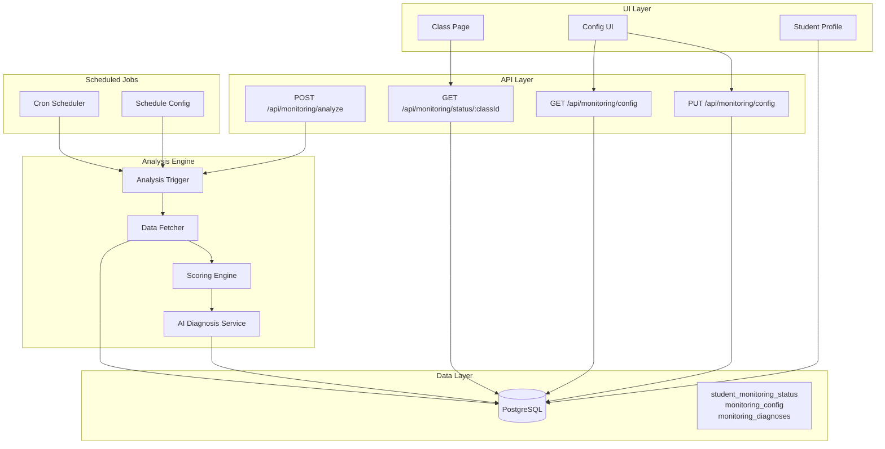

# Student Monitoring System - Traffic Light Prioritization

## Overview

This document outlines the architecture for a student monitoring system that analyzes student data and flags students requiring attention using a traffic light system (Red/Yellow/Green).

## System Goals

- **Automated Analysis**: Daily analysis of student assessment data over the last 14 days
- **Intelligent Prioritization**: AI-driven diagnosis with weighted scoring
- **Actionable Insights**: Generate intervention suggestions for teachers
- **Flexible Scheduling**: Configurable analysis timing with manual trigger option
- **Historical Tracking**: Store diagnosis history with timestamps

## Architecture Overview



## Database Schema

### 1. student_monitoring_status Table

Stores current monitoring status for each student.

```sql
CREATE TABLE student_monitoring_status (
    id UUID PRIMARY KEY DEFAULT gen_random_uuid(),
    student_id UUID NOT NULL REFERENCES students(id) ON DELETE CASCADE,
    class_id UUID NOT NULL REFERENCES classes(id) ON DELETE CASCADE,

    -- Priority flag (traffic light)
    priority_flag VARCHAR(10) NOT NULL CHECK (priority_flag IN ('red', 'yellow', 'green')),

    -- Weighted score (0-100)
    priority_score NUMERIC(5,2) NOT NULL,

    -- Score components
    observation_score NUMERIC(5,2),
    trend_score NUMERIC(5,2),
    homework_score NUMERIC(5,2),

    -- AI diagnosis
    diagnosis_summary TEXT,

    -- Analysis metadata
    analyzed_at TIMESTAMP WITH TIME ZONE NOT NULL,
    analysis_period_start DATE NOT NULL,
    analysis_period_end DATE NOT NULL,

    -- Timestamps
    created_at TIMESTAMP WITH TIME ZONE DEFAULT NOW(),
    updated_at TIMESTAMP WITH TIME ZONE DEFAULT NOW(),

    -- Ensure one status per student per class
    UNIQUE(student_id, class_id)
);

CREATE INDEX idx_student_monitoring_priority ON student_monitoring_status(priority_flag, priority_score DESC);
CREATE INDEX idx_student_monitoring_class ON student_monitoring_status(class_id, priority_flag);
CREATE INDEX idx_student_monitoring_analyzed ON student_monitoring_status(analyzed_at);
```

### 2. monitoring_diagnoses Table

Stores AI-generated diagnoses and intervention suggestions.

```sql
CREATE TABLE monitoring_diagnoses (
    id UUID PRIMARY KEY DEFAULT gen_random_uuid(),
    status_id UUID NOT NULL REFERENCES student_monitoring_status(id) ON DELETE CASCADE,

    -- Diagnosis details
    diagnosis_text TEXT NOT NULL,
    confidence NUMERIC(3,2) CHECK (confidence >= 0 AND confidence <= 1),

    -- Detected patterns
    patterns JSONB, -- Array of detected patterns

    -- Intervention suggestions
    interventions JSONB NOT NULL, -- Array of intervention objects

    -- AI metadata
    ai_model VARCHAR(100),
    ai_temperature NUMERIC(3,2),
    ai_tokens_used INTEGER,

    -- Timestamps
    created_at TIMESTAMP WITH TIME ZONE DEFAULT NOW(),

    -- Index for fast retrieval
    CONSTRAINT valid_interventions CHECK (jsonb_typeof(interventions) = 'array')
);

CREATE INDEX idx_monitoring_diagnoses_status ON monitoring_diagnoses(status_id);
CREATE INDEX idx_monitoring_diagnoses_created ON monitoring_diagnoses(created_at);
```

### 3. monitoring_config Table

Stores system configuration.

```sql
CREATE TABLE monitoring_config (
    id UUID PRIMARY KEY DEFAULT gen_random_uuid(),

    -- Scheduling
    analysis_time TIME NOT NULL DEFAULT '22:00:00', -- 10 PM
    timezone VARCHAR(50) DEFAULT 'America/Buenos_Aires',
    enabled BOOLEAN DEFAULT true,

    -- Analysis window
    analysis_days INTEGER DEFAULT 14 CHECK (analysis_days > 0),

    -- Scoring weights (must sum to 100)
    weight_observation NUMERIC(5,2) DEFAULT 40.00,
    weight_trend NUMERIC(5,2) DEFAULT 35.00,
    weight_homework NUMERIC(5,2) DEFAULT 25.00,

    -- Threshold for flags
    red_threshold NUMERIC(5,2) DEFAULT 70.00,
    yellow_threshold NUMERIC(5,2) DEFAULT 40.00,

    -- Timestamps
    created_at TIMESTAMP WITH TIME ZONE DEFAULT NOW(),
    updated_at TIMESTAMP WITH TIME ZONE DEFAULT NOW(),

    -- Constraint: only one config row
    CONSTRAINT single_config CHECK (id = '00000000-0000-0000-0000-000000000001'::uuid),

    -- Constraint: weights sum to 100
    CONSTRAINT valid_weights CHECK (
        weight_observation + weight_trend + weight_homework = 100
    )
);

-- Insert default configuration
INSERT INTO monitoring_config (id)
VALUES ('00000000-0000-0000-0000-000000000001'::uuid)
ON CONFLICT (id) DO NOTHING;
```

## Weighted Scoring Algorithm

### Score Components (0-100 scale each)

#### 1. Observation Score (40% weight)

Measures days since last teacher observation.

```typescript
function calculateObservationScore(daysSinceLastObservation: number): number {
  if (daysSinceLastObservation === 0) return 0;
  if (daysSinceLastObservation <= 3) return 20;
  if (daysSinceLastObservation <= 7) return 50;
  if (daysSinceLastObservation <= 10) return 75;
  return 100; // More than 10 days
}
```

#### 2. Trend Score (35% weight)

Analyzes declining patterns in assessment variables.

```typescript
function calculateTrendScore(assessments: Assessment[]): number {
  // Calculate trend for each variable over 14 days
  // Use linear regression to detect decline
  // Score based on:
  // - Slope: steeper decline = higher score
  // - Consistency: more variables declining = higher score
  // - Magnitude: larger drops = higher score

  const variableTrends = assessments.reduce((acc, assessment) => {
    // Group by variable and calculate trend
    return acc;
  }, {});

  const decliningCount = Object.values(variableTrends).filter(
    (trend) => trend.slope < -0.05
  ).length;

  const totalVariables = Object.keys(variableTrends).length;

  return (decliningCount / totalVariables) * 100;
}
```

#### 3. Homework Score (25% weight)

Detects missing or incomplete homework patterns.

```typescript
function calculateHomeworkScore(
  assessments: Assessment[],
  homeworkVariableId: string
): number {
  const homeworkAssessments = assessments
    .filter((a) => a.variableId === homeworkVariableId)
    .sort((a, b) => b.createdAt.getTime() - a.createdAt.getTime())
    .slice(0, 5); // Last 5 homework entries

  const lowScores = homeworkAssessments.filter((a) => a.value < 0.6).length;

  const missingCount = 5 - homeworkAssessments.length;

  return ((lowScores + missingCount) / 5) * 100;
}
```

#### 4. Final Priority Score

```typescript
function calculatePriorityScore(
  observationScore: number,
  trendScore: number,
  homeworkScore: number,
  weights: { observation: number; trend: number; homework: number }
): number {
  return (
    (observationScore * weights.observation) / 100 +
    (trendScore * weights.trend) / 100 +
    (homeworkScore * weights.homework) / 100
  );
}

function getPriorityFlag(
  score: number,
  thresholds: { red: number; yellow: number }
): 'red' | 'yellow' | 'green' {
  if (score >= thresholds.red) return 'red';
  if (score >= thresholds.yellow) return 'yellow';
  return 'green';
}
```

## AI Diagnosis Service

### Input Structure

```typescript
interface MonitoringAnalysisContext {
  student: {
    id: string;
    name: string;
    age: number;
    grade: number;
  };
  class: {
    name: string;
    grade: number;
    section: string;
  };
  analysisWindow: {
    startDate: string;
    endDate: string;
  };
  scores: {
    observation: number;
    trend: number;
    homework: number;
    final: number;
  };
  assessmentData: {
    variables: Array<{
      id: string;
      name: string;
      description: string;
      recentValues: Array<{
        date: string;
        value: number;
        comments?: string;
      }>;
      trend: 'improving' | 'stable' | 'declining';
      average: number;
    }>;
  };
}
```

### AI Prompt Template

```typescript
function createMonitoringPrompt(context: MonitoringAnalysisContext): string {
  return `
You are an educational monitoring assistant analyzing student performance patterns.

STUDENT CONTEXT:
- Name: ${context.student.name}
- Age: ${context.student.age}
- Grade: ${context.class.grade}${context.class.section}
- Analysis Period: ${context.analysisWindow.startDate} to ${context.analysisWindow.endDate}

PRIORITY SCORES:
- Observation Gap Score: ${context.scores.observation}/100
- Trend Analysis Score: ${context.scores.trend}/100
- Homework Compliance Score: ${context.scores.homework}/100
- FINAL PRIORITY SCORE: ${context.scores.final}/100

ASSESSMENT VARIABLE ANALYSIS:
${context.assessmentData.variables
  .map(
    (v) => `
- ${v.name}: ${v.trend} (avg: ${v.average})
  Recent values: ${v.recentValues.map((rv) => `${rv.date}: ${rv.value}`).join(', ')}
  ${
    v.recentValues.some((rv) => rv.comments)
      ? 'Comments: ' +
        v.recentValues
          .filter((rv) => rv.comments)
          .map((rv) => rv.comments)
          .join('; ')
      : ''
  }
`
  )
  .join('\n')}

TASK: Provide a concise diagnosis and actionable interventions.

RESPONSE FORMAT (JSON only):
{
    "diagnosis": "Brief 1-2 sentence summary of main concerns",
    "confidence": 0.0-1.0,
    "patterns": [
        {
            "type": "declining_trend" | "missing_observations" | "homework_issues" | "specific_variable",
            "description": "What pattern was detected",
            "severity": "high" | "medium" | "low",
            "variablesAffected": ["variable names"]
        }
    ],
    "interventions": [
        {
            "priority": "immediate" | "soon" | "monitor",
            "action": "Specific intervention (max 2 sentences)",
            "targetArea": "Variable or skill to address",
            "expectedOutcome": "What this should achieve"
        }
    ]
}

GUIDELINES:
- Be specific and actionable
- Focus on the most critical 2-3 interventions
- Consider the student's age and grade level
- Reference specific variables when relevant
- If score is low (green), acknowledge positive progress
`;
}
```

### Output Structure

```typescript
interface MonitoringDiagnosis {
  diagnosis: string;
  confidence: number;
  patterns: Array<{
    type:
      | 'declining_trend'
      | 'missing_observations'
      | 'homework_issues'
      | 'specific_variable';
    description: string;
    severity: 'high' | 'medium' | 'low';
    variablesAffected: string[];
  }>;
  interventions: Array<{
    priority: 'immediate' | 'soon' | 'monitor';
    action: string;
    targetArea: string;
    expectedOutcome: string;
  }>;
}
```

## Service Architecture

### 1. MonitoringService

```typescript
// app/lib/services/student-monitoring-service.ts

export class StudentMonitoringService {
  constructor(
    private assessmentService: AssessmentService,
    private studentService: StudentService,
    private ai: AssessmentAI
  ) {}

  async analyzeClass(classId: string): Promise<void>;
  async analyzeStudent(
    studentId: string,
    classId: string
  ): Promise<StudentMonitoringStatus>;
  async getClassMonitoringStatus(
    classId: string
  ): Promise<StudentMonitoringStatus[]>;
  async getStudentMonitoringStatus(
    studentId: string
  ): Promise<StudentMonitoringStatus | null>;
  async getStudentDiagnoses(
    studentId: string,
    limit?: number
  ): Promise<MonitoringDiagnosis[]>;

  private calculateScores(
    studentId: string,
    days: number
  ): Promise<ScoreComponents>;
  private generateDiagnosis(
    context: MonitoringAnalysisContext
  ): Promise<MonitoringDiagnosis>;
  private saveDiagnosis(
    statusId: string,
    diagnosis: MonitoringDiagnosis
  ): Promise<void>;
}
```

### 2. MonitoringConfigService

```typescript
// app/lib/services/monitoring-config-service.ts

export class MonitoringConfigService {
  async getConfig(): Promise<MonitoringConfig>;
  async updateConfig(
    config: Partial<MonitoringConfig>
  ): Promise<MonitoringConfig>;
  async getScheduleInfo(): Promise<{ nextRun: Date; enabled: boolean }>;
}
```

### 3. Scheduled Job System

Using Next.js API Routes with external cron service or node-cron:

```typescript
// app/api/monitoring/cron/route.ts

export async function GET(request: Request) {
  // Verify cron secret
  const authHeader = request.headers.get('authorization');
  if (authHeader !== `Bearer ${process.env.CRON_SECRET}`) {
    return new Response('Unauthorized', { status: 401 });
  }

  const config = await monitoringConfigService.getConfig();

  if (!config.enabled) {
    return Response.json({ skipped: true, reason: 'Monitoring disabled' });
  }

  // Get all classes
  const classes = await getAllClasses();

  const results = [];
  for (const classItem of classes) {
    try {
      await monitoringService.analyzeClass(classItem.id);
      results.push({ classId: classItem.id, status: 'success' });
    } catch (error) {
      results.push({
        classId: classItem.id,
        status: 'error',
        error: error.message
      });
    }
  }

  return Response.json({
    timestamp: new Date().toISOString(),
    results
  });
}
```

## API Endpoints

### 1. POST /api/monitoring/analyze

Manually trigger analysis for a class or student.

```typescript
// Request
{
    "classId": "uuid",
    "studentId": "uuid" // Optional - if omitted, analyzes entire class
}

// Response
{
    "success": true,
    "analyzed": {
        "classId": "uuid",
        "studentCount": 25,
        "timestamp": "2025-01-17T22:00:00Z",
        "summary": {
            "red": 3,
            "yellow": 8,
            "green": 14
        }
    }
}
```

### 2. GET /api/monitoring/status/:classId

Get monitoring status for all students in a class.

```typescript
// Response
{
    "students": [
        {
            "id": "student-uuid",
            "name": "Student Name",
            "priorityFlag": "red",
            "priorityScore": 78.5,
            "scores": {
                "observation": 85,
                "trend": 72,
                "homework": 80
            },
            "diagnosisSummary": "Student shows declining trend in homework and participation",
            "analyzedAt": "2025-01-17T22:00:00Z"
        }
    ]
}
```

### 3. GET /api/monitoring/student/:studentId/diagnoses

Get diagnosis history for a student.

```typescript
// Response
{
    "diagnoses": [
        {
            "id": "uuid",
            "createdAt": "2025-01-17T22:00:00Z",
            "diagnosis": "Student shows improving trend in most areas",
            "confidence": 0.85,
            "patterns": [...],
            "interventions": [...]
        }
    ]
}
```

### 4. GET /api/monitoring/config

Get current monitoring configuration.

### 5. PUT /api/monitoring/config

Update monitoring configuration.

## UI Implementation

### 1. Class Page Enhancement

```tsx
// app/(routes)/class/[id]/client.tsx

interface StudentWithMonitoring extends Student {
  monitoringStatus?: {
    priorityFlag: 'red' | 'yellow' | 'green';
    priorityScore: number;
    diagnosisSummary?: string;
  };
}

function StudentAvatar({ student }: { student: StudentWithMonitoring }) {
  const bgColorClass = {
    red: 'bg-red-100 ring-2 ring-red-500',
    yellow: 'bg-yellow-100 ring-2 ring-yellow-500',
    green: 'bg-green-100 ring-2 ring-green-500',
    undefined: ''
  }[student.monitoringStatus?.priorityFlag || 'undefined'];

  return (
    <Link href={`/student/${student.id}`}>
      <div className={`rounded-lg p-2 ${bgColorClass}`}>
        {/* Avatar content */}
      </div>
    </Link>
  );
}

function ClassRosterClient({ students, classId }: Props) {
  const [sortBy, setSortBy] = useState<'name' | 'priority'>('priority');
  const [filterFlag, setFilterFlag] = useState<
    'all' | 'red' | 'yellow' | 'green'
  >('all');

  const sortedStudents = useMemo(() => {
    let filtered =
      filterFlag === 'all'
        ? students
        : students.filter(
            (s) => s.monitoringStatus?.priorityFlag === filterFlag
          );

    if (sortBy === 'priority') {
      return filtered.sort(
        (a, b) =>
          (b.monitoringStatus?.priorityScore || 0) -
          (a.monitoringStatus?.priorityScore || 0)
      );
    }
    return filtered.sort((a, b) => a.name.localeCompare(b.name));
  }, [students, sortBy, filterFlag]);

  return (
    <div>
      {/* Controls */}
      <div className="flex gap-4 mb-4">
        <select value={sortBy} onChange={(e) => setSortBy(e.target.value)}>
          <option value="priority">Por Prioridad</option>
          <option value="name">Por Nombre</option>
        </select>

        <div className="flex gap-2">
          <button onClick={() => setFilterFlag('all')}>Todos</button>
          <button onClick={() => setFilterFlag('red')}>🔴 Urgente</button>
          <button onClick={() => setFilterFlag('yellow')}>🟡 Atención</button>
          <button onClick={() => setFilterFlag('green')}>🟢 Bien</button>
        </div>
      </div>

      {/* Student Grid */}
      <div className="grid grid-cols-2 sm:grid-cols-3 gap-8">
        {sortedStudents.map((student) => (
          <StudentAvatar key={student.id} student={student} />
        ))}
      </div>
    </div>
  );
}
```

### 2. Student Profile Enhancement

```tsx
// app/(routes)/student/[id]/client.tsx

function StudentDiagnosisSection({ studentId }: { studentId: string }) {
  const [diagnoses, setDiagnoses] = useState<MonitoringDiagnosis[]>([]);

  useEffect(() => {
    fetch(`/api/monitoring/student/${studentId}/diagnoses?limit=3`)
      .then((res) => res.json())
      .then((data) => setDiagnoses(data.diagnoses));
  }, [studentId]);

  if (!diagnoses.length) return null;

  const latest = diagnoses[0];

  return (
    <div className="mt-8 p-6 bg-blue-50 rounded-lg">
      <h3 className="text-lg font-semibold mb-4">
        Diagnóstico y Recomendaciones
      </h3>

      <div className="mb-4">
        <p className="text-gray-700">{latest.diagnosis}</p>
        <span className="text-sm text-gray-500">
          Confianza: {(latest.confidence * 100).toFixed(0)}%
        </span>
      </div>

      {latest.patterns?.length > 0 && (
        <div className="mb-4">
          <h4 className="font-medium mb-2">Patrones Detectados:</h4>
          <ul className="list-disc list-inside space-y-1">
            {latest.patterns.map((pattern, idx) => (
              <li key={idx} className="text-sm">
                <span
                  className={`font-medium ${
                    pattern.severity === 'high'
                      ? 'text-red-600'
                      : pattern.severity === 'medium'
                        ? 'text-yellow-600'
                        : 'text-green-600'
                  }`}
                >
                  {pattern.severity === 'high'
                    ? '🔴'
                    : pattern.severity === 'medium'
                      ? '🟡'
                      : '🟢'}
                </span>{' '}
                {pattern.description}
              </li>
            ))}
          </ul>
        </div>
      )}

      {latest.interventions?.length > 0 && (
        <div>
          <h4 className="font-medium mb-2">Intervenciones Sugeridas:</h4>
          <div className="space-y-3">
            {latest.interventions.map((intervention, idx) => (
              <div
                key={idx}
                className="bg-white p-3 rounded border-l-4 border-blue-500"
              >
                <div className="flex items-start gap-2">
                  <span
                    className={`px-2 py-1 text-xs rounded ${
                      intervention.priority === 'immediate'
                        ? 'bg-red-100 text-red-700'
                        : intervention.priority === 'soon'
                          ? 'bg-yellow-100 text-yellow-700'
                          : 'bg-green-100 text-green-700'
                    }`}
                  >
                    {intervention.priority === 'immediate'
                      ? 'Inmediato'
                      : intervention.priority === 'soon'
                        ? 'Pronto'
                        : 'Monitorear'}
                  </span>
                </div>
                <p className="mt-2 text-sm font-medium">
                  {intervention.action}
                </p>
                <p className="text-xs text-gray-600 mt-1">
                  Área: {intervention.targetArea}
                </p>
                <p className="text-xs text-gray-500 mt-1">
                  Resultado esperado: {intervention.expectedOutcome}
                </p>
              </div>
            ))}
          </div>
        </div>
      )}
    </div>
  );
}
```

### 3. Configuration UI

```tsx
// app/(routes)/monitoring/page.tsx

function MonitoringConfigPage() {
  const [config, setConfig] = useState<MonitoringConfig | null>(null);
  const [isSaving, setIsSaving] = useState(false);

  // Form for updating configuration
  // - Analysis time
  // - Weights (observation, trend, homework)
  // - Thresholds (red, yellow)
  // - Analysis window (days)

  return (
    <div className="max-w-2xl mx-auto p-6">
      <h1 className="text-2xl font-bold mb-6">
        Configuración del Sistema de Monitoreo
      </h1>

      {/* Configuration form */}

      <button
        onClick={handleManualAnalysis}
        className="mt-4 px-4 py-2 bg-blue-600 text-white rounded"
      >
        Ejecutar Análisis Ahora
      </button>
    </div>
  );
}
```

## Technology Stack & Tools

### Scheduling Options

1. **External Cron Service** (Recommended for production)
   - **Vercel Cron** (if deploying to Vercel)
   - **GitHub Actions** with scheduled workflows
   - **EasyCron** or similar services
2. **Node-based Scheduler** (for development/self-hosted)
   - `node-cron` package
   - Run in separate Node process

### Example: Vercel Cron

```json
// vercel.json
{
  "crons": [
    {
      "path": "/api/monitoring/cron",
      "schedule": "0 22 * * *" // 10 PM daily (adjust in DB config)
    }
  ]
}
```

### Example: node-cron (development)

```typescript
// scripts/monitoring-scheduler.ts
import cron from 'node-cron';

async function runMonitoring() {
  const config = await getConfig();
  if (!config.enabled) return;

  // Trigger analysis
  await fetch('http://localhost:3000/api/monitoring/cron', {
    headers: { Authorization: `Bearer ${process.env.CRON_SECRET}` }
  });
}

// Schedule based on DB config
const schedule = '0 22 * * *'; // Read from config
cron.schedule(schedule, runMonitoring);
```

## Performance Considerations

### Optimization Strategies

1. **Batch Processing**: Analyze students in parallel with `Promise.all` (limit concurrency)
2. **Caching**: Cache AI responses for identical patterns within 24h
3. **Incremental Updates**: Only re-analyze students with new data
4. **Database Indexes**: Proper indexes on frequently queried columns
5. **Connection Pooling**: Reuse database connections

### Example: Parallel Processing

```typescript
async analyzeClass(classId: string): Promise<void> {
    const students = await this.studentService.getStudentsForClass(classId);

    // Process in batches of 5 to avoid overwhelming AI service
    const batchSize = 5;
    for (let i = 0; i < students.length; i += batchSize) {
        const batch = students.slice(i, i + batchSize);
        await Promise.all(
            batch.map(student =>
                this.analyzeStudent(student.id, classId)
                    .catch(err => console.error(`Failed for ${student.name}:`, err))
            )
        );
    }
}
```

## Testing Strategy

### Unit Tests

```typescript
describe('Scoring Algorithm', () => {
  it('calculates observation score correctly', () => {
    expect(calculateObservationScore(0)).toBe(0);
    expect(calculateObservationScore(5)).toBe(50);
    expect(calculateObservationScore(12)).toBe(100);
  });

  it('calculates final weighted score', () => {
    const score = calculatePriorityScore(50, 60, 40, {
      observation: 40,
      trend: 35,
      homework: 25
    });
    expect(score).toBe(51); // (50*0.4 + 60*0.35 + 40*0.25)
  });
});

describe('MonitoringService', () => {
  it('generates correct priority flag', async () => {
    // Mock student with high priority score
    const status = await service.analyzeStudent('student-id', 'class-id');
    expect(status.priorityFlag).toBe('red');
  });
});
```

### Integration Tests

```typescript
describe('Monitoring API', () => {
  it('analyzes class and returns summary', async () => {
    const response = await fetch('/api/monitoring/analyze', {
      method: 'POST',
      body: JSON.stringify({ classId: 'test-class-id' })
    });

    const data = await response.json();
    expect(data.success).toBe(true);
    expect(data.analyzed.summary).toHaveProperty('red');
  });
});
```

## Migration Plan

### Phase 1: Database Setup

1. Create new tables via migration
2. Add indexes
3. Seed initial configuration

### Phase 2: Backend Services

1. Implement scoring algorithm
2. Create MonitoringService
3. Extend AI service with diagnosis prompts
4. Build API endpoints

### Phase 3: Scheduled Jobs

1. Set up cron endpoint
2. Configure external scheduler
3. Add manual trigger capability

### Phase 4: UI Updates

1. Update class page with color coding
2. Add sorting and filtering
3. Implement student profile diagnosis section
4. Create admin configuration page

### Phase 5: Testing & Refinement

1. Test scoring algorithm with real data
2. Validate AI diagnosis quality
3. Fine-tune weights and thresholds
4. Performance optimization

## Security Considerations

1. **Cron Endpoint**: Protect with secret token
2. **API Authentication**: Ensure proper auth on all endpoints
3. **Rate Limiting**: Prevent abuse of analysis endpoints
4. **Data Privacy**: Secure storage of diagnoses
5. **Input Validation**: Validate all configuration updates

## Monitoring & Observability

1. **Logging**: Log all analysis runs with results
2. **Error Tracking**: Alert on repeated failures
3. **Metrics**: Track analysis duration, AI costs
4. **Audit Trail**: Record configuration changes

## Future Enhancements

1. **Email Notifications**: Alert teachers when students turn red
2. **Trend Visualization**: Show priority score over time
3. **Custom Variables**: Allow teachers to configure which variables affect homework score
4. **Multi-language Support**: Diagnoses in teacher's preferred language
5. **Export Reports**: Generate PDF reports of diagnoses
6. **Parent Portal**: Share appropriate diagnoses with families
