# Student Monitoring System - Traffic Light Prioritization

## Quick Overview

A comprehensive student monitoring system that automatically analyzes student assessment data and flags students requiring teacher attention using a traffic light system (🔴 Red, 🟡 Yellow, 🟢 Green).

## Features

✅ **Automated Analysis**: Daily scheduled analysis of student performance patterns  
✅ **AI-Powered Diagnosis**: Intelligent pattern detection and intervention suggestions  
✅ **Weighted Scoring**: Combines observation gaps, trend analysis, and homework compliance  
✅ **Visual Prioritization**: Color-coded student avatars on class page  
✅ **Actionable Insights**: Specific intervention recommendations for teachers  
✅ **Configurable System**: Adjustable weights, thresholds, and scheduling  
✅ **Historical Tracking**: Stores diagnosis history with timestamps

## Traffic Light System

### 🔴 Red (Urgent - Score ≥70)

- Requires immediate teacher attention
- Multiple concerning patterns detected
- Intervention needed today

### 🟡 Yellow (Attention Needed - Score 40-69)

- Monitor closely
- Some patterns of concern
- Plan intervention soon

### 🟢 Green (Good - Score `<40`)

- Progressing well
- No immediate concerns
- Continue current approach

## How It Works

```mermaid
graph LR
    A[Daily Cron Job] --> B[Fetch Student Data]
    B --> C[Calculate Scores]
    C --> D{Weighted Score}
    D --> E[Observation Gap]
    D --> F[Trend Analysis]
    D --> G[Homework Compliance]
    E --> H[Final Score 0-100]
    F --> H
    G --> H
    H --> I{Assign Flag}
    I --> J[🔴 Red]
    I --> K[🟡 Yellow]
    I --> L[🟢 Green]
    H --> M[AI Diagnosis]
    M --> N[Store Results]
    N --> O[Display in UI]
```



## Scoring Algorithm

### Final Score = (Observation × 40%) + (Trend × 35%) + (Homework × 25%)

**Observation Score** (40% weight)

- Days since last teacher observation
- 0 days = 0 points, 10+ days = 100 points

**Trend Score** (35% weight)

- Declining patterns in assessment variables
- Linear regression analysis over 14 days

**Homework Score** (25% weight)

- Missing or low-quality homework submissions
- Last 5 homework entries analyzed

## Architecture Documents

📘 **[Architecture](./student-monitoring-system-architecture.md)** - Complete system architecture with diagrams
📘 **[Database Schema](./student-monitoring-system-database.md)** - Database tables and schema details
📘 **[Implementation Guide](./student-monitoring-system-implementation.md)** - Step-by-step implementation guide

## Quick Start

### 1. Database Setup

```bash
# Apply migration
cd supabase
supabase db push

# Or manually run the migration file
# supabase/migrations/20250117000000_add_student_monitoring_system.sql
```

### 2. Environment Variables

```env
# Add to .env.local
CRON_SECRET=your-secure-random-string
GOOGLE_AI_API_KEY=your-api-key
```

### 3. Configure Scheduling

**For Vercel:**

```json
// vercel.json
{
  "crons": [
    {
      "path": "/api/monitoring/cron",
      "schedule": "0 22 * * *"
    }
  ]
}
```

**For GitHub Actions:**

```yaml
# .github/workflows/monitoring-cron.yml
on:
  schedule:
    - cron: '0 22 * * *'
```

### 4. Run Manual Analysis (Testing)

```bash
# Via API endpoint
curl -X POST http://localhost:3000/api/monitoring/analyze \
  -H "Content-Type: application/json" \
  -d '{"classId": "your-class-id"}'

# Or use the admin UI
# Navigate to /admin/monitoring and click "Run Analysis Now"
```

## Database Tables

### student_monitoring_status

Current monitoring status for each student (one row per student per class).

### monitoring_diagnoses

AI-generated diagnoses with intervention suggestions (historical records).

### monitoring_config

System configuration (singleton table) for scheduling and scoring parameters.

## API Endpoints

| Method | Endpoint                                | Description                   |
| ------ | --------------------------------------- | ----------------------------- |
| POST   | `/api/monitoring/analyze`               | Manually trigger analysis     |
| GET    | `/api/monitoring/status/:classId`       | Get class monitoring status   |
| GET    | `/api/monitoring/student/:id/diagnoses` | Get student diagnosis history |
| GET    | `/api/monitoring/config`                | Get system configuration      |
| PUT    | `/api/monitoring/config`                | Update configuration          |
| GET    | `/api/monitoring/cron`                  | Scheduled job endpoint        |

## UI Components

### Class Page (`/class/:id`)

- Color-coded student avatars
- Sort by priority or name
- Filter by red/yellow/green
- Priority score display

### Student Profile (`/student/:id`)

- Diagnosis summary section
- Detected patterns list
- Intervention suggestions
- Confidence score
- Historical diagnoses

### Admin Config (`/admin/monitoring`)

- Adjust scoring weights
- Set thresholds
- Configure schedule
- Manual trigger button

## Configuration Options

```typescript
{
  analysisTime: "22:00:00",        // Time to run analysis
  timezone: "America/Buenos_Aires",
  enabled: true,                   // Enable/disable system
  analysisDays: 14,                // Days of data to analyze
  weightObservation: 40,           // % weight for observation gap
  weightTrend: 35,                 // % weight for trends
  weightHomework: 25,              // % weight for homework
  redThreshold: 70,                // Score ≥ this = red flag
  yellowThreshold: 40,             // Score ≥ this = yellow flag
  homeworkVariableName: "Tareas"   // Name of homework variable
}
```

## Example Diagnosis Output

```json
{
  "diagnosis": "Student shows declining trend in participation and homework completion over the past two weeks.",
  "confidence": 0.85,
  "patterns": [
    {
      "type": "declining_trend",
      "description": "Participation scores decreased from 0.8 to 0.4",
      "severity": "high",
      "variablesAffected": ["Participación"]
    },
    {
      "type": "homework_issues",
      "description": "3 out of last 5 homework assignments incomplete",
      "severity": "medium",
      "variablesAffected": ["Tareas"]
    }
  ],
  "interventions": [
    {
      "priority": "immediate",
      "action": "Schedule one-on-one meeting to understand barriers to participation and homework completion.",
      "targetArea": "Engagement and Accountability",
      "expectedOutcome": "Identify root cause and create support plan"
    },
    {
      "priority": "soon",
      "action": "Implement daily check-ins for homework assignment clarity.",
      "targetArea": "Homework Compliance",
      "expectedOutcome": "Improved homework completion rate"
    }
  ]
}
```

## Tech Stack

- **Framework**: Next.js 15+ (App Router)
- **Database**: Supabase (PostgreSQL)
- **AI**: Google Generative AI (Gemini)
- **Scheduling**: Vercel Cron / GitHub Actions / node-cron
- **UI**: React, Tailwind CSS
- **Validation**: Zod
- **Testing**: Playwright, Vitest

## Performance Considerations

- **Batch Processing**: Students analyzed in parallel (batches of 5)
- **Caching**: AI responses cached for identical patterns
- **Indexes**: Optimized database queries with proper indexes
- **Rate Limiting**: AI API calls throttled to avoid limits

## Security

- ✅ Cron endpoint protected with secret token
- ✅ API authentication on all endpoints
- ✅ Input validation with Zod schemas
- ✅ Row Level Security (RLS) policies
- ✅ Secure storage of diagnoses

## Monitoring

Track these metrics:

- Analysis success rate
- Average analysis duration
- AI API costs per analysis
- Database query performance
- Students flagged red/yellow/green ratio

## Troubleshooting

### Analysis not running?

- Check cron configuration
- Verify `enabled` flag in config
- Check API logs for errors

### Invalid scores?

- Verify assessment data exists
- Check scoring weights sum to 100
- Review calculation logs

### AI diagnosis fails?

- Check API key validity
- Verify rate limits not exceeded
- Review prompt format

### Students not showing colors?

- Ensure analysis has run
- Check database for status records
- Verify UI data fetching

## Future Enhancements

- [ ] Email notifications when students turn red
- [ ] Trend visualization charts
- [ ] Custom variable configuration
- [ ] Multi-language support for diagnoses
- [ ] PDF report generation
- [ ] Parent portal integration

## Development Workflow

1. **Design Phase**: Review architecture documents ✅
2. **Database**: Apply migration and verify schema
3. **Backend**: Implement services and scoring algorithm
4. **API**: Build endpoints with validation
5. **Scheduling**: Configure cron jobs
6. **UI**: Update class and profile pages
7. **Testing**: Write and run tests
8. **Deploy**: Production deployment
9. **Monitor**: Track metrics and gather feedback
10. **Iterate**: Adjust weights and thresholds

## Support

For implementation questions or issues:

1. Review `IMPLEMENTATION_GUIDE.md` for detailed steps
2. Check `ARCHITECTURE.md` for system design
3. Refer to `DATABASE_SCHEMA.md` for data structure
4. Open GitHub issue with details

## License

Part of the Mehmiro educational assessment platform.

---

**Ready to implement?** Start with the [Implementation Guide](./student-monitoring-system-implementation.md) and follow the phase-by-phase instructions.
