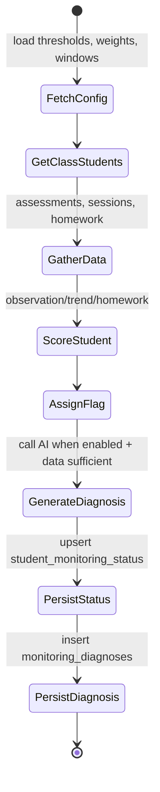

# 🏗️ Student Monitoring System — Architecture

This document captures the technical design for the Student Monitoring System, including system topology, service responsibilities, scoring logic, and API design. Use it alongside the [Overview](overview.md), [Database Schema](database.md), and [Implementation Guide](implementation-guide.md) when planning or iterating on the feature.

---

## 🔝 High-Level System Diagram

```mermaid
graph TD
    subgraph "Schedulers"
        Cron[Vercel Cron / GitHub Actions]
        Manual[Manual Trigger]
    end

    subgraph "API Layer (Next.js App Router)"
        AnalyzeAPI[POST /api/monitoring/analyze]
        CronAPI[GET /api/monitoring/cron]
        StatusAPI[GET /api/monitoring/status/:classId]
        StudentDiagAPI[GET /api/monitoring/student/:studentId/diagnoses]
        ConfigAPI[GET/PUT /api/monitoring/config]
    end

    subgraph "Service Layer"
        MonitorSvc[StudentMonitoringService]
        ConfigSvc[MonitoringConfigService]
        ScoreUtil[Scoring Utilities]
        AISvc[AssessmentAI]
        AssessSvc[AssessmentService]
        StudentSvc[StudentService]
    end

    subgraph "Data Layer"
        SupabaseDB[(Supabase Postgres)]
        StatusTable[student_monitoring_status]
        DiagnosesTable[monitoring_diagnoses]
        ConfigTable[monitoring_config]
    end

    subgraph "UI / Consumer Layer"
        ClassUI[/Class Roster /class/[id]/]
        StudentUI[/Student Profile /student/[id]/]
        AdminUI[/Admin Monitoring Config (planned)/]
        Metrics[/Monitoring Dashboard (future)/]
    end

    Cron --> CronAPI
    Manual --> AnalyzeAPI

    AnalyzeAPI --> MonitorSvc
    CronAPI --> MonitorSvc
    StatusAPI --> MonitorSvc
    StudentDiagAPI --> MonitorSvc
    ConfigAPI --> ConfigSvc

    MonitorSvc --> AssessSvc
    MonitorSvc --> StudentSvc
    MonitorSvc --> ScoreUtil
    MonitorSvc --> AISvc
    MonitorSvc --> SupabaseDB
    ConfigSvc --> SupabaseDB
    AISvc --> SupabaseDB

    SupabaseDB --> StatusTable
    SupabaseDB --> DiagnosesTable
    SupabaseDB --> ConfigTable

    StatusTable --> ClassUI
    StatusTable --> StudentUI
    DiagnosesTable --> StudentUI
    ConfigTable --> AdminUI
```

---

## 🧩 Core Building Blocks

| Layer      | Responsibility                                                         | Key Files                                                                            |
| ---------- | ---------------------------------------------------------------------- | ------------------------------------------------------------------------------------ |
| Scheduler  | Kick off analysis via cron or manual action.                           | `vercel.json`, GitHub workflow, `/api/monitoring/cron`                               |
| API Routes | Validate requests, invoke services, return JSON.                       | `/app/api/monitoring/*/route.ts`                                                     |
| Services   | Orchestrate data fetching, scoring, AI, persistence.                   | `app/lib/services/student-monitoring-service.ts`, `.../monitoring-config-service.ts` |
| Utilities  | Provide reusable scoring and prompt helpers.                           | `app/lib/utils/monitoring-scores.ts`, `app/lib/services/assessment-ai.ts`            |
| Database   | Persist status snapshots, diagnoses, and config.                       | `supabase/migrations/*_student_monitoring_system.sql`                                |
| UI         | Surface flags, scores, and diagnoses inside class/student experiences. | `app/(routes)/class/[id]`, `app/(routes)/student/[id]`, planned admin route          |

---

## ⚙️ Service Responsibilities

### `StudentMonitoringService`



Key operations:

- `analyzeClass(classId)` — loop through roster (batched).
- `analyzeStudent(studentId, classId?)` — targeted recalculation.
- `getClassMonitoringStatus(classId)` — fetch latest results for UI.
- `getStudentDiagnoses(studentId, limit?)` — return ordered history.

### `MonitoringConfigService`

- `getConfig()` — fetch singleton row (`0000...001`).
- `updateConfig(partial)` — Zod validation, update fields, enforce invariants.
- `getScheduleInfo()` — compute next run time based on timezone + `analysis_time`.

### AI Integration

- `AssessmentAI.analyzeStudentMonitoring(context)`:
  - Accepts `MonitoringAnalysisContext`.
  - Builds deterministic prompt (see snippet below).
  - Parses JSON, validates via schema (e.g., Zod).
  - Surfaces `diagnosis`, `patterns`, `interventions`, `confidence`.

Prompt excerpt (stored near service):

```typescript
You are an educational monitoring assistant...
Provide JSON only:
{
  "diagnosis": "...",
  "confidence": 0.85,
  "patterns": [...],
  "interventions": [...]
}
```

---

## 🧮 Weighted Scoring Model

### Observation Gap (`40%`)

- Input: days since latest teacher-authored assessment or note.
- Threshold mapping:

| Days Since | Score |
| ---------- | ----- |
| 0          | 0     |
| 1–3        | 20    |
| 4–7        | 50    |
| 8–10       | 75    |
| ≥ 11       | 100   |

TypeScript utility:

```typescript
export function calculateObservationScore(days: number): number {
  if (days <= 0) return 0;
  if (days <= 3) return 20;
  if (days <= 7) return 50;
  if (days <= 10) return 75;
  return 100;
}
```

### Trend Analysis (`35%`)

- Evaluate linear regression slope across the last `analysisDays` assessments per variable.
- Penalize declining slopes (< -0.05) and large drops.
- Score = `(declining variables / total variables) * 100`.

Implementation notes:

- Use least-squares regression on normalized variable values.
- Consider multi-source data (teacher, student, family) for richer context.
- Cache results to avoid recomputation within a single run.

### Homework Compliance (`25%`)

- Inspect last `5` entries of the configured homework variable.
- Count low scores (< 0.6) and missing submissions.
- Score = `((low + missing) / 5) * 100`.

### Final Score & Flag

```typescript
const finalScore =
  (observationScore * weights.observation) / 100 +
  (trendScore * weights.trend) / 100 +
  (homeworkScore * weights.homework) / 100;

const flag =
  finalScore >= redThreshold
    ? 'red'
    : finalScore >= yellowThreshold
      ? 'yellow'
      : 'green';
```

- Persist `observation_score`, `trend_score`, `homework_score`, `priority_score`, and `priority_flag`.

---

## 🤖 AI Diagnosis Workflow

1. Gather `MonitoringAnalysisContext`:
   - Student + class metadata.
   - Analysis window start/end.
   - Calculated scores.
   - Recent assessment values grouped by variable.

2. Call Gemini (or future provider) with deterministic prompt.
3. Parse JSON string response; validate using schema:

```typescript
const MonitoringDiagnosisSchema = z.object({
  diagnosis: z.string().min(1),
  confidence: z.number().min(0).max(1),
  patterns: z
    .array(
      z.object({
        type: z.enum([
          'declining_trend',
          'missing_observations',
          'homework_issues',
          'specific_variable'
        ]),
        description: z.string(),
        severity: z.enum(['high', 'medium', 'low']),
        variablesAffected: z.array(z.string())
      })
    )
    .optional(),
  interventions: z.array(
    z.object({
      priority: z.enum(['immediate', 'soon', 'monitor']),
      action: z.string(),
      targetArea: z.string(),
      expectedOutcome: z.string()
    })
  )
});
```

4. Store results in `monitoring_diagnoses` with metadata (model, temperature, tokens).

5. Return aggregated object to UI via service.

---

## 🌐 API Surface Details

| Route                                          | Method    | Security                                 | Notes                                                          |
| ---------------------------------------------- | --------- | ---------------------------------------- | -------------------------------------------------------------- |
| `/api/monitoring/analyze`                      | `POST`    | Authenticated; optionally require admin  | Body `{ classId, studentId? }`, runs service, returns summary. |
| `/api/monitoring/cron`                         | `GET`     | Bearer token (`CRON_SECRET`)             | Iterates classes; respond with success/error per class.        |
| `/api/monitoring/status/:classId`              | `GET`     | Authenticated teacher of class           | Returns array of status entries with scores & summaries.       |
| `/api/monitoring/student/:studentId/diagnoses` | `GET`     | Authenticated teacher of student’s class | Returns diagnosis history (limit query param optional).        |
| `/api/monitoring/config`                       | `GET/PUT` | Authenticated admin                      | Enforces schema, returns updated config.                       |

Implementation tips:

- Validate `classId`/`studentId` against teacher ownership using Supabase RLS or server-side checks.
- Rate-limit manual analyze route to prevent abuse.
- Provide idempotent cron execution (skip when `enabled=false`).

---

## 🖥️ UI Integration Points

### `/class/[id]`

- Fetch statuses server-side and merge with student roster.
- Provide controls for:
  - Sorting by priority score or name.
  - Filtering by flag (All/Red/Yellow/Green).
- Visual cues: colored avatar borders, priority badges, score text.

### `/student/[id]`

- Diagnosis panel component:
  - Latest diagnosis summary with confidence.
  - Pattern list (with severity icons).
  - Intervention cards (priority tags, expected outcome).
  - Button to view history (modal/table).
- Show last analyzed timestamp with relative time (e.g., “Analyzed 3 hours ago”).

### `/admin/monitoring` (Planned)

- Form fields for weights, thresholds, analysis window, timezone, schedule.
- Manual trigger button (with class dropdown optional).
- Display next scheduled run and last run status.

---

## 🔐 Security Considerations

- **Row Level Security**:
  - `student_monitoring_status`: limit by class ownership (`class.teacher_id = auth.uid()`).
  - `monitoring_diagnoses`: join to status row before returning.
- **Cron Protection**:
  - Reject requests without `Authorization: Bearer ${CRON_SECRET}` header.
- **Input Validation**:
  - Always validate request bodies with Zod or equivalent.
  - Ensure weights sum to 100 and thresholds are ordered.
- **Audit Logging**:
  - Log each analysis run (classId, duration, success/failure).
  - Track config changes (old vs new values, user, timestamp).

---

## 📊 Observability & Metrics

Recommended metrics/logs:

| Metric                              | Description                               | Tooling                                  |
| ----------------------------------- | ----------------------------------------- | ---------------------------------------- |
| `monitoring_analysis_duration_ms`   | Time to analyze a class.                  | Influx/Prometheus via custom logger.     |
| `monitoring_analysis_failure_total` | Count of failed class/student analyses.   | Alert when above threshold.              |
| `monitoring_priority_distribution`  | Gauge of red/yellow/green counts per day. | Supabase analytics or BI dashboard.      |
| `monitoring_ai_tokens_consumed`     | Tokens used per diagnosis run.            | Track via AI provider metadata.          |
| `monitoring_config_changes`         | Audit log for config updates.             | Insert into log table or external store. |

---

## 📅 Delivery Phases (Summary)

1. **Database Foundations** — tables, indexes, default config.
2. **Types & Schemas** — TypeScript types, Zod validators.
3. **Scoring Utilities** — Deterministic scoring functions + unit tests.
4. **AI Integration** — Prompt design, parsing, validation, error handling.
5. **Service Layer** — StudentMonitoringService orchestration.
6. **API Routes** — REST endpoints with access control.
7. **Schedulers** — Cron endpoint + infrastructure config.
8. **UI Enhancements** — Class roster + student profile updates.
9. **Admin UX** — Configuration page (future).
10. **Testing** — Unit, integration, BDD, e2e coverage.
11. **Observability** — Logging, metrics, alerting hooks.

Refer to the [Implementation Guide](implementation-guide.md) for detailed tasks, acceptance criteria, and test instructions per phase.

---

## 📚 Related Links

- [Overview](overview.md)
- [Database Schema](database.md)
- [Implementation Guide](implementation-guide.md)
- [Feature Lifecycle Process](../../processes/feature-lifecycle.md)
- [Testing Strategy](../../standards/testing-strategy.md)
- [System Architecture](../../architecture/system-architecture.md)
