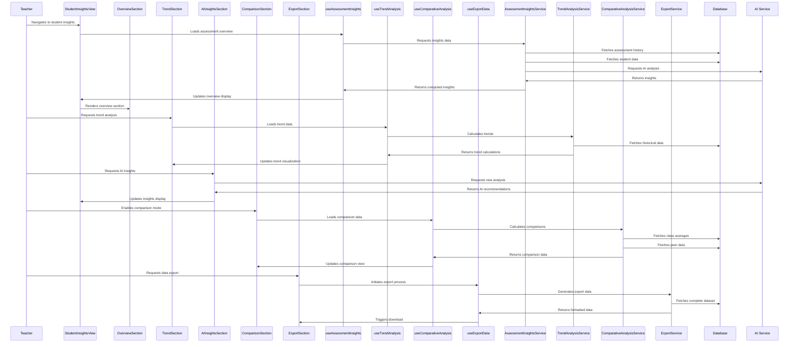
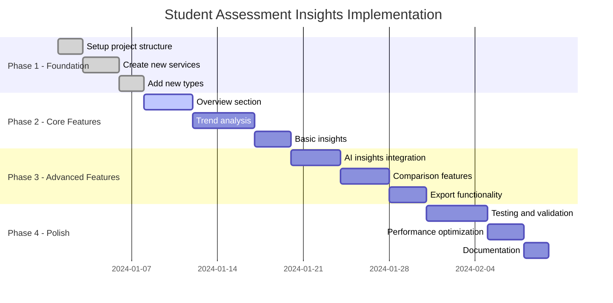

# 🏗️ Student Assessment Insights - Architecture Diagram

## 📊 Complete Feature Architecture

```mermaid
graph TB
    %% User Interface Layer
    subgraph "🖥️ UI Layer - New Components"
        StudentInsightsView[📊 StudentInsightsView<br/>Main Container]
        OverviewSection[📈 OverviewSection<br/>NEW - Assessment Summary]
        TrendSection[📈 TrendSection<br/>NEW - Progress Analysis]
        AIInsightsSection[🤖 AIInsightsSection<br/>NEW - AI Recommendations]
        ComparisonSection[⚖️ ComparisonSection<br/>NEW - Peer Comparison]
        ExportSection[📤 ExportSection<br/>NEW - Data Export]
    end

    subgraph "🖥️ UI Layer - Reused Components"
        StudentInfo[👤 StudentInfo<br/>EXISTING - Basic Info]
        StudentRadarChart[🕸️ StudentRadarChart<br/>EXISTING - Assessment Viz]
        StudentLinearChart[📈 StudentLinearChart<br/>EXISTING - Trend Viz]
        ViewSelector[🔄 ViewSelector<br/>EXISTING - View Toggle]
        DateNavigation[📅 DateNavigation<br/>EXISTING - Date Picker]
        ErrorBoundary[🛡️ ErrorBoundary<br/>EXISTING - Error Handling]
    end

    %% Hooks Layer
    subgraph "🪝 Hooks Layer - New Hooks"
        useAssessmentInsights[🪝 useAssessmentInsights<br/>NEW - Insights Logic]
        useTrendAnalysis[🪝 useTrendAnalysis<br/>NEW - Trend Calculations]
        useComparativeAnalysis[🪝 useComparativeAnalysis<br/>NEW - Comparison Logic]
        useExportData[🪝 useExportData<br/>NEW - Export Functions]
    end

    subgraph "🪝 Hooks Layer - Reused Hooks"
        useStudents[🪝 useStudents<br/>EXISTING - Student Data]
        useAssessments[🪝 useAssessments<br/>EXISTING - Assessment Data]
        useAI[🪝 useAI<br/>EXISTING - AI Analysis]
    end

    %% Service Layer
    subgraph "⚙️ Service Layer - New Services"
        AssessmentInsightsService[🎯 AssessmentInsightsService<br/>NEW - Insights Business Logic]
        TrendAnalysisService[📈 TrendAnalysisService<br/>NEW - Trend Calculations]
        ComparativeAnalysisService[⚖️ ComparativeAnalysisService<br/>NEW - Comparison Logic]
        ExportService[📤 ExportService<br/>NEW - Data Export]
    end

    subgraph "⚙️ Service Layer - Reused Services"
        StudentService[👥 StudentService<br/>EXISTING - CRUD Operations]
        AssessmentService[📊 AssessmentService<br/>EXISTING - Assessment Logic]
        AssessmentAI[🤖 AssessmentAI<br/>EXISTING - AI Analysis]
    end

    %% Data Layer
    subgraph "💾 Data Layer"
        SupabaseDB[(☁️ Supabase<br/>Assessments + Sessions)]
        CachedData[(💾 Cache<br/>Computed Insights)]
        ExportStorage[(📁 Export Files<br/>PDF/Excel/CSV)]
    end

    %% External APIs
    subgraph "🌐 External Integrations"
        ChartLibrary[📊 Chart.js/D3<br/>Visualization]
        PDFGenerator[📄 jsPDF<br/>PDF Export]
        ExcelGenerator[📊 ExcelJS<br/>Excel Export]
    end

    %% Flow Connections - UI to Hooks
    StudentInsightsView --> useAssessmentInsights
    StudentInsightsView --> useStudents
    StudentInsightsView --> useAssessments

    OverviewSection --> useAssessmentInsights
    TrendSection --> useTrendAnalysis
    AIInsightsSection --> useAI
    ComparisonSection --> useComparativeAnalysis
    ExportSection --> useExportData

    %% Reused UI Components
    StudentInsightsView --> StudentInfo
    TrendSection --> StudentLinearChart
    TrendSection --> DateNavigation
    OverviewSection --> ViewSelector
    ErrorBoundary -.-> StudentInsightsView

    %% Flow Connections - Hooks to Services
    useAssessmentInsights --> AssessmentInsightsService
    useAssessmentInsights --> StudentService
    useAssessmentInsights --> AssessmentService

    useTrendAnalysis --> TrendAnalysisService
    useTrendAnalysis --> AssessmentService

    useComparativeAnalysis --> ComparativeAnalysisService
    useComparativeAnalysis --> StudentService

    useExportData --> ExportService

    useStudents --> StudentService
    useAssessments --> AssessmentService
    useAI --> AssessmentAI

    %% Flow Connections - Services to Data
    AssessmentInsightsService --> SupabaseDB
    TrendAnalysisService --> SupabaseDB
    ComparativeAnalysisService --> SupabaseDB
    ExportService --> SupabaseDB

    StudentService --> SupabaseDB
    AssessmentService --> SupabaseDB
    AssessmentAI --> SupabaseDB

    %% Service Data Flow
    AssessmentService --> AssessmentInsightsService
    StudentService --> AssessmentInsightsService
    StudentService --> TrendAnalysisService
    StudentService --> ComparativeAnalysisService

    AssessmentAI --> AssessmentInsightsService

    %% Caching and Storage
    AssessmentInsightsService --> CachedData
    TrendAnalysisService --> CachedData
    CachedData -.-> AssessmentInsightsService

    ExportService --> ExportStorage

    %% External Integrations
    TrendSection --> ChartLibrary
    ComparisonSection --> ChartLibrary
    ExportSection --> PDFGenerator
    ExportSection --> ExcelGenerator

    %% Styling Indicators
    classDef newComponent fill:#e1f5fe,stroke:#01579b,stroke-width:2px
    classDef reusedComponent fill:#f3e5f5,stroke:#4a148c,stroke-width:1px
    classDef newService fill:#e8f5e8,stroke:#1b5e20,stroke-width:2px
    classDef reusedService fill:#fce4ec,stroke:#bf360c,stroke-width:1px

    %% Apply styling
    class OverviewSection,TrendSection,AIInsightsSection,ComparisonSection,ExportSection newComponent
    class StudentInfo,StudentRadarChart,StudentLinearChart,ViewSelector,DateNavigation,ErrorBoundary reusedComponent
    class AssessmentInsightsService,TrendAnalysisService,ComparativeAnalysisService,ExportService newService
    class StudentService,AssessmentService,AssessmentAI reusedService
```

## 🔄 Component Interaction Flow

## 📊 Data Flow Architecture

```mermaid
graph LR
    %% Data Sources
    AssessmentData[📊 Assessment Data<br/>Teacher/Student/Family/AI]
    StudentData[👤 Student Data<br/>Profile + Demographics]
    ClassData[🏫 Class Data<br/>Peers + Averages]
    HistoricalData[📈 Historical Data<br/>Time-series Assessments]

    %% Data Processing Pipeline
    DataAggregator[📊 Data Aggregator<br/>Combine Sources]
    TrendCalculator[📈 Trend Calculator<br/>Progress Analysis]
    InsightGenerator[🤖 Insight Generator<br/>AI Analysis]
    ComparisonEngine[⚖️ Comparison Engine<br/>Benchmark Calculation]

    %% Data Transformation
    Normalization[🔄 Normalization<br/>Scale Standardization]
    Filtering[🔍 Filtering<br/>Date/Source Filters]
    Grouping[📋 Grouping<br/>Variable/Session Groups]

    %% Data Presentation
    Visualization[📊 Visualization<br/>Charts/Graphs]
    Insights[💡 Insights<br/>Recommendations]
    Comparisons[⚖️ Comparisons<br/>Relative Performance]
    ExportData[📤 Export Data<br/>Formatted Reports]

    %% Flow Connections
    AssessmentData --> DataAggregator
    StudentData --> DataAggregator
    ClassData --> ComparisonEngine
    HistoricalData --> TrendCalculator

    DataAggregator --> Normalization
    Normalization --> Filtering
    Filtering --> Grouping

    Grouping --> TrendCalculator
    Grouping --> InsightGenerator
    Grouping --> ComparisonEngine

    TrendCalculator --> Visualization
    InsightGenerator --> Insights
    ComparisonEngine --> Comparisons

    Visualization --> ExportData
    Insights --> ExportData
    Comparisons --> ExportData

    %% Data Storage
    subgraph "Storage Layer"
        RealTimeDB[(☁️ Real-time DB<br/>Live Data)]
        CacheLayer[(💾 Cache Layer<br/>Computed Results)]
        ExportStorage[(📁 Export Files<br/>Generated Reports)]
    end

    RealTimeDB --> AssessmentData
    RealTimeDB --> StudentData
    RealTimeDB --> ClassData
    RealTimeDB --> HistoricalData

    CacheLayer -.-> DataAggregator
    CacheLayer -.-> TrendCalculator
    CacheLayer -.-> InsightGenerator

    ExportData --> ExportStorage
```

## 🎨 Component Reuse vs New Development

| Component Type    | Reused Components                                                                          | New Components                                                                                     | Rationale                                                                          |
| ----------------- | ------------------------------------------------------------------------------------------ | -------------------------------------------------------------------------------------------------- | ---------------------------------------------------------------------------------- |
| **UI Components** | `StudentInfo`, `StudentRadarChart`, `StudentLinearChart`, `ViewSelector`, `DateNavigation` | `StudentOverviewCard`, `TrendChart`, `AIInsightCard`, `ComparisonChart`, `ExportModal`             | Leverage existing visualization patterns while adding specialized insight displays |
| **Hooks**         | `useStudents`, `useAssessments`, `useAI`                                                   | `useAssessmentInsights`, `useTrendAnalysis`, `useComparativeAnalysis`, `useExportData`             | Build on existing data fetching patterns with new business logic                   |
| **Services**      | `StudentService`, `AssessmentService`, `AssessmentAI`                                      | `AssessmentInsightsService`, `TrendAnalysisService`, `ComparativeAnalysisService`, `ExportService` | Extend existing services with new insight capabilities                             |
| **Types**         | `Student`, `Assessment`, `AssessmentVariable`                                              | `AssessmentInsight`, `TrendData`, `ComparisonMetric`, `ExportFormat`                               | Add new types while maintaining compatibility                                      |

## 🔧 Technical Architecture Patterns

### Reused Patterns

- **Custom Hooks Pattern**: `useStudents`, `useAssessments` → `useAssessmentInsights`
- **Service Layer Pattern**: `StudentService`, `AssessmentService` → `AssessmentInsightsService`
- **Component Composition**: `StudentInfo` + `StudentRadarChart` → `StudentOverviewCard`
- **Error Boundary Pattern**: Existing `ErrorBoundary` wrapper

### New Patterns

- **Insight Aggregation Pattern**: Multiple data sources → unified insights
- **Comparative Analysis Pattern**: Student performance vs benchmarks
- **Export Strategy Pattern**: Multiple format support (PDF/Excel/CSV/JSON)
- **Real-time Insight Pattern**: Live updates as new assessments arrive

## 📈 Implementation Phases

## 🎯 Key Architecture Decisions

### **Component Reuse Strategy**

- **Maximize reuse** of existing chart components (`StudentRadarChart`, `StudentLinearChart`)
- **Extend patterns** rather than replace (hooks, services, types)
- **Maintain consistency** with existing design system and patterns

### **New Component Design**

- **Composable architecture** - New components built from reused pieces
- **Separation of concerns** - UI, business logic, and data access separated
- **Scalable patterns** - Easy to add new insight types and visualizations

### **Data Architecture**

- **Unified data access** through service layer
- **Intelligent caching** for computed insights
- **Real-time updates** leveraging Supabase subscriptions
- **Export flexibility** supporting multiple formats

This architecture ensures the feature integrates seamlessly with the existing codebase while providing powerful new insights capabilities.
