# 🚦 Student Monitoring System — Traffic Light Prioritization

The Student Monitoring System analyzes assessment activity, homework adherence, and observational data to automatically flag students who require teacher attention. It combines a weighted scoring model, AI-generated diagnoses, and configurable scheduling to deliver actionable insights that align with Mehmiro’s BDD/TDD delivery standards.

---

## 🔍 Feature Summary

- ✅ **Automated Analysis** — Scheduled or on-demand evaluations across every class.
- ✅ **AI-Powered Diagnoses** — Google Gemini produces structured intervention recommendations.
- ✅ **Weighted Scoring** — Observation gaps, performance trends, and homework compliance merge into a single priority score.
- ✅ **Traffic Light Flags** — Students are surfaced as 🔴 (urgent), 🟡 (attention), or 🟢 (on track).
- ✅ **Historical Tracking** — Every diagnosis is versioned for longitudinal review.
- ✅ **Configurable Controls** — Teachers/admins can adjust weights, thresholds, and cron cadence.
- ✅ **UI Integration** — Class rosters, student profiles, and admin panels surface monitoring data contextually.

The end-to-end implementation plan, schema design, and execution steps are captured across the companion docs:

- [Architecture](student-monitoring-system-architecture.md)
- [Database Schema](student-monitoring-system-database.md)
- [Implementation Guide](student-monitoring-system-implementation.md)

---

## 🧭 Traffic Light Model

| Flag      | Score Range | Meaning            | Recommended Action     |
| --------- | ----------- | ------------------ | ---------------------- |
| 🔴 Red    | ≥ 70        | High priority risk | Immediate intervention |
| 🟡 Yellow | 40–69       | Emerging concerns  | Plan support promptly  |
| 🟢 Green  | < 40        | Stable trajectory  | Continue monitoring    |

The composite score is calculated as:

```text
Final Score = (Observation × 40%) + (Trend × 35%) + (Homework × 25%)
```

See the [Architecture](student-monitoring-system-architecture.md#weighted-scoring-algorithm) page for formulas, TypeScript snippets, and extensibility notes.

---

## 🧠 How It Works (At a Glance)

```mermaid
graph LR
    Cron[⏱️ Cron / Manual Trigger] --> Fetch[📥 Fetch Class + Assessments]
    Fetch --> Score[🧮 Calculate Weighted Scores]
    Score --> Flag{🚦 Assign Flag}
    Score --> AI[🤖 Generate AI Diagnosis]
    Flag --> Status[🗄️ student_monitoring_status]
    AI --> Diagnoses[📚 monitoring_diagnoses]
    Status --> UI[🖥️ Class & Student UI]
    Diagnoses --> UI
```



1. **Trigger** — Scheduled cron job or manual POST to `/api/monitoring/analyze`.
2. **Data Fetch** — Assessments, variables, and session history retrieved per class/student.
3. **Scoring** — Observation gap, trend regression, and homework compliance transformed into a normalized score.
4. **Flagging** — Score thresholds map to traffic light categories.
5. **Diagnosis** — Structured AI prompt produces patterns, confidence, and interventions.
6. **Persistence** — Results stored in dedicated monitoring tables.
7. **UI Refresh** — Class rosters, student profiles, and admin dashboards surface the latest state.

---

## 📁 File Map

```text
docs-portal/docs/features/student-monitoring-system/
├── overview.md                 # This page
├── architecture.md             # System & service diagrams
├── database.md                 # SQL schema & queries
└── implementation-guide.md     # Phase-by-phase execution plan

features/student-monitoring-system/
├── README.md                   # Source collateral (legacy location)
├── ARCHITECTURE.md
├── DATABASE_SCHEMA.md
└── IMPLEMENTATION_GUIDE.md
```

> The files inside `features/student-monitoring-system/` remain as source collateral. Treat the docs portal pages as the living, centralized version.

---

## ⚙️ Configuration Snapshot

The monitoring engine is controlled through a singleton record:

```typescript
{
  analysisTime: "22:00:00",
  timezone: "America/Buenos_Aires",
  enabled: true,
  analysisDays: 14,
  weightObservation: 40,
  weightTrend: 35,
  weightHomework: 25,
  redThreshold: 70,
  yellowThreshold: 40,
  homeworkVariableName: "Tareas"
}
```

- Adjust values through `/api/monitoring/config` (admin UI planned).
- Enforce validation using `MonitoringConfigSchema` in `app/lib/schemas.ts`.

---

## 🌐 API Surface

| Endpoint                                       | Method  | Description                                                        |
| ---------------------------------------------- | ------- | ------------------------------------------------------------------ |
| `/api/monitoring/analyze`                      | POST    | Run monitoring for a class, optionally scoped to a single student. |
| `/api/monitoring/status/:classId`              | GET     | Retrieve traffic-light status and scores for a class roster.       |
| `/api/monitoring/student/:studentId/diagnoses` | GET     | Fetch the diagnosis history for a student.                         |
| `/api/monitoring/config`                       | GET/PUT | View or update system configuration.                               |
| `/api/monitoring/cron`                         | GET     | Cron-protected entry point for scheduled analysis.                 |

Detailed request/response payloads live in the [Implementation Guide](student-monitoring-system-implementation.md#phase-6-api-endpoints-).

---

## 🖥️ UI Entry Points

| Surface                       | Enhancements                                                                    |
| ----------------------------- | ------------------------------------------------------------------------------- |
| `/class/[id]`                 | Student avatars gain colored borders, priority sorting, and filtering controls. |
| `/student/[id]`               | Diagnosis panel surfaces AI summary, patterns, interventions, and history.      |
| `/admin/monitoring` (planned) | Configuration form, schedule preview, and manual trigger button.                |

Component responsibilities and mockups are documented in [Architecture](student-monitoring-system-architecture.md#ui-layer) and the implementation phase breakdown.

---

## 🚀 Quick Start Workflow

```bash
# 1. Apply database migration
cd supabase
supabase db push

# 2. Ensure environment variables
# CRON_SECRET=your-secure-string
# GOOGLE_AI_API_KEY=...

# 3. Execute manual analysis during development
curl -X POST http://localhost:3000/api/monitoring/analyze \
  -H "Content-Type: application/json" \
  -d '{"classId":"<class-id>"}'

# 4. Schedule cron (Vercel example)
# vercel.json → { "crons": [{ "path": "/api/monitoring/cron", "schedule": "0 22 * * *" }] }
```

Testing expectations are enumerated in the [Implementation Guide](student-monitoring-system-implementation.md#phase-11-testing-).

---

## 🔒 Security & Compliance

- **RLS Enforcement** — All tables honor `students`/`classes` scopes tied to teacher identities.
- **Cron Protection** — `/api/monitoring/cron` checks for a bearer token (`CRON_SECRET`).
- **Input Validation** — Zod schemas guard configuration updates and analysis requests.
- **Auditability** — Timestamps on every table with optional change logs in a future iteration.

---

## 📈 Observability & Operations

Key metrics to instrument:

- Analysis success/failure counts
- Average analysis duration (per class/student)
- AI token consumption & latency
- Priority flag distribution (red/yellow/green ratios)
- Configuration change history

Logging guidance and sample payloads live in the [Implementation Guide](student-monitoring-system-implementation.md#monitoring--observability).

---

## 🗺️ Delivery Roadmap Overview

| Phase | Focus                   | Outcome                                   |
| ----- | ----------------------- | ----------------------------------------- |
| 1     | Database foundations    | Tables, indexes, default config           |
| 2     | Types & schemas         | TypeScript contracts, Zod validation      |
| 3     | Scoring utilities       | Deterministic scoring functions + tests   |
| 4     | AI integration          | Prompt template, JSON parsing, validation |
| 5     | Monitoring service      | Orchestration, persistence, diagnostics   |
| 6     | API surface             | REST endpoints & handlers                 |
| 7     | Scheduling              | Cron, secrets, manual triggers            |
| 8     | UI integration          | Class roster surfacing                    |
| 9     | Student profile         | Diagnosis rendering                       |
| 10    | Admin configuration     | Control panel UX                          |
| 11    | Testing                 | Unit, integration, BDD, E2E suites        |
| 12    | Documentation & rollout | Docs updates, deployment checklist        |

Each phase is elaborated with tasks, code snippets, and acceptance criteria inside the [Implementation Guide](student-monitoring-system-implementation.md).

---

## ✅ Acceptance Criteria & TDD Alignment

The feature follows Mehmiro’s **BDD-first** approach:

1. Draft or update Gherkin scenarios (see `tests/bdd/features/student-monitoring-system.feature`, to be added when development begins).
2. Expand builders and fixtures to satisfy scenarios.
3. Implement services and UI using **Red → Green → Refactor**.
4. Run the verification stack:

```bash
pnpm run format
pnpm run lint -- --fix
pnpm run type-check
pnpm run build

pnpm test:unit
pnpm test:integration
pnpm test:bdd -- --tags @smoke
pnpm test:e2e --project chromium

pnpm docs:build
pnpm docs:test
```

---

## 📚 Related Resources

- [Feature Lifecycle Process](../../processes/feature-lifecycle.md) — BDD/TDD governance.
- [Testing Strategy](../../standards/testing-strategy.md) — Coverage expectations across test layers.
- [System Architecture](../../architecture/system-architecture.md) — Platform-level context.

---

## 📌 Next Steps & Enhancements

- Email/web notifications when students move into 🔴 status.
- Trend visualizations for score history.
- Custom variable weighting per class.
- Parent/guardian-friendly summaries.
- Multi-language AI diagnoses.

Use the sidebar to deep-dive into the **Architecture**, **Database**, and **Implementation** pages to plan or execute delivery.
